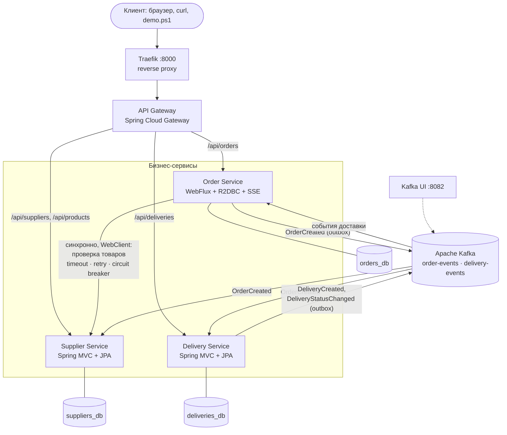
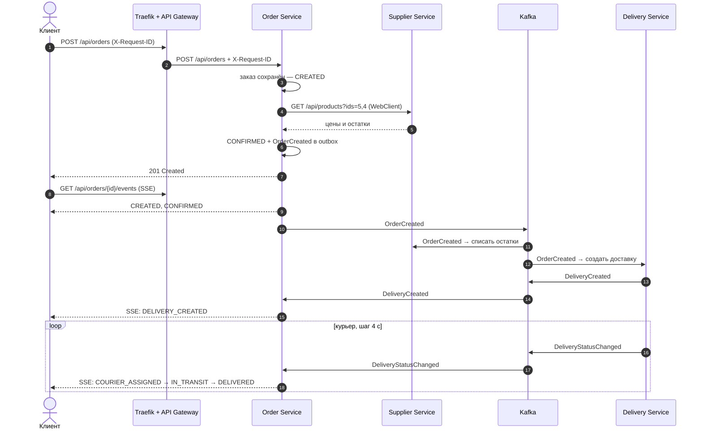

# Архитектура проекта — ПР №8

Схема распределённой системы поставщиков и доставки: какие компоненты в неё
входят, как они связаны, где хранятся данные и как проходят запросы и события.
Подробное описание реализации, запуск и скриншоты — в [README.md](README.md).

## 1. Общая схема

```
                               Client (браузер, curl, demo.ps1)
                                            │  http://localhost:8000
                                            ▼
                             ┌─────────────────────────────┐
                             │           Traefik           │  внешний reverse proxy:
                             │      инфраструктурная       │  принимает весь трафик,
                             │        маршрутизация        │  dashboard :8081
                             └──────────────┬──────────────┘
                                            │ любой путь → API Gateway
                                            ▼
                             ┌─────────────────────────────┐
                             │         API Gateway         │  Spring Cloud Gateway:
                             │   маршруты · X-Request-ID   │  маршрутизация внутри приложения,
                             │  circuit breaker · fallback │  /actuator/health/system
                             └───┬──────────┬──────────┬───┘
       /api/suppliers/**         │          │          │         /api/deliveries/**
       /api/products/**          │          │          │
               ┌─────────────────┘          │          └──────────────────┐
               ▼                            ▼ /api/orders/**              ▼
   ┌───────────────────────┐   WebClient   ┌───────────────────────┐   ┌───────────────────────┐
   │   Supplier Service    │◄──────────────│     Order Service     │   │   Delivery Service    │
   │   Spring MVC + JPA    │ GET товаров:  │ WebFlux + R2DBC + SSE │   │   Spring MVC + JPA    │
   │  поставщики, товары,  │ timeout,      │  заказы, их статусы,  │   │ доставки, курьер,     │
   │  остатки на складе    │ retry, CB     │  поток статусов       │   │ тарифы                │
   └───────────┬───────────┘               └───────────┬───────────┘   └───────────┬───────────┘
               ▼                                       ▼                           ▼
         suppliers_db                              orders_db                 deliveries_db
       (свой PostgreSQL)                       (свой PostgreSQL)           (свой PostgreSQL)
               ▲                                       │ ▲                         │ ▲
               │ OrderCreated                          │ │ события                 │ │ OrderCreated
               │                          OrderCreated │ │ доставки        события │ │
   ┌───────────┴───────────────────────────────────────▼─┴─────────────────────────▼─┴───────────┐
   │                                  Apache Kafka (KRaft)                                       │
   │   order-events:     Order Service ──► Delivery Service, Supplier Service                    │
   │   delivery-events:  Delivery Service ──► Order Service                                      │
   └─────────────────────────────────────────────────────────────────────────────────────────────┘
                                   Kafka UI :8082 — просмотр топиков и групп
```

Та же схема в Mermaid (GitHub рисует её картинкой):



## 2. Компоненты

| Компонент | Технология | Отвечает за | Данные | Доступ снаружи |
| --------- | ---------- | ----------- | ------ | -------------- |
| Traefik | Traefik v3.6 | приём трафика, проверка здоровья Gateway, журнал запросов | — | `:8000`, dashboard `:8081` |
| API Gateway | Spring Cloud Gateway (WebFlux) | маршруты `/api/...`, X-Request-ID, circuit breaker + fallback, сводный health, демо-страница | — | только через Traefik |
| Supplier Service | Spring MVC + JPA | поставщики, товары, цены, остатки; списание по `OrderCreated` | `suppliers_db` | нет |
| Order Service | Spring WebFlux + R2DBC | заказы, проверка товаров у Supplier, статусы, SSE-поток | `orders_db` | нет |
| Delivery Service | Spring MVC + JPA | доставки по `OrderCreated`, имитация курьера | `deliveries_db` | нет |
| PostgreSQL ×3 | postgres:17-alpine | отдельная БД у каждого сервиса | тома Docker | нет |
| Kafka | Apache Kafka 3.9 (KRaft) | брокер событий | том `kafka-data` | нет |
| Kafka UI | kafbat/kafka-ui | просмотр топиков, сообщений, групп | — | `:8082` |

Разделение ответственности маршрутизации: **Traefik** — инфраструктура
(контейнеры, порты, здоровье), **API Gateway** — приложение (какой путь в какой
сервис, что ответить при отказе).

## 3. Сети и изоляция данных

```
          msa-edge (обычная сеть, есть выход наружу)
   ┌──────────────────────────────────────────────────────┐
   │   traefik            api-gateway           kafka-ui  │
   └──────────────────────────┬──────────────────────┬────┘
          msa-backend (internal: без выхода наружу)  │
   ┌──────────────────────────┴──────────────────────┴────────────────────┐
   │  api-gateway   supplier-service   order-service   delivery-service   │
   │                                                    kafka   kafka-ui  │
   └───────┬─────────────────────┬────────────────────────┬──────────────┘
           │                     │                        │
   msa-suppliers-data    msa-orders-data         msa-deliveries-data      (все internal)
   supplier-service      order-service           delivery-service
   suppliers-db          orders-db               deliveries-db
```

- Наружу опубликованы только Traefik (`8000`, `8081`) и Kafka UI (`8082`).
- Каждая БД видна только своему сервису: для Delivery Service имя `orders-db`
  даже не резолвится. Данные чужого сервиса приходят только через API или события.

| Сервис | Владеет данными | Таблицы |
| ------ | --------------- | ------- |
| Supplier Service | поставщики, товары, остатки | `supplier`, `product`, `processed_event` |
| Order Service | заказы, позиции, история статусов | `orders`, `order_items`, `order_status_history`, `outbox` |
| Delivery Service | доставки, курьеры, стоимость доставки | `delivery`, `processed_event`, `outbox_event` |

## 4. Взаимодействие сервисов

### 4.1. Синхронное (HTTP)

```
Order Service ──GET /api/products?ids=5,4──► Supplier Service
              ◄────── цены и остатки ────────
   Retry( CircuitBreaker( TimeLimiter( запрос ) ) )
   таймаут 2 с на попытку · 3 попытки (паузы 200 и 400 мс) · circuit breaker: 50 % отказов → OPEN на 15 с
```

### 4.2. Асинхронное (Kafka)

| Топик | Ключ | Производитель | Потребители (группы) | События |
| ----- | ---- | ------------- | -------------------- | ------- |
| `order-events` | `orderId` | Order Service | `delivery-service`, `supplier-service` | `OrderCreated` |
| `delivery-events` | `orderId` | Delivery Service | `order-service` | `DeliveryCreated`, `DeliveryStatusChanged` |
| `*.DLT` | — | обработчик ошибок | — | сообщения, которые не удалось обработать |

```
 Order Service                                                  Kafka
 ┌──────────── одна транзакция orders_db ───────────┐
 │ UPDATE orders → CONFIRMED                        │
 │ INSERT order_status_history                      │      OutboxRelay
 │ INSERT outbox (OrderCreated, sent_at = NULL)     │ ───────────────────► order-events
 └──────────────────────────────────────────────────┘

 order-events ──► Delivery Service: processed_event (eventId) + UNIQUE order_id → доставка, outbox → delivery-events
              └─► Supplier Service: processed_event (eventId) → списание остатков
 delivery-events ──► Order Service: статус только вперёд → история → SSE клиенту
```

## 5. Сквозной сценарий



Статусы заказа:

```
CREATED ──► CONFIRMED ──► DELIVERY_CREATED ──► COURIER_ASSIGNED ──► IN_TRANSIT ──► DELIVERED
   │            │                │                    │
   ▼            └────────────────┴────────────────────┴──► CANCELLED
REJECTED  (нет товара / нет в каталоге / Supplier Service недоступен)
```

## 6. Сквозной идентификатор запроса (X-Request-ID)

```
Client ─X-Request-ID─► Traefik (access log) ─► API Gateway (создаёт, если нет) ─► Order Service (MDC)
                                                                                     │         │
                                                         HTTP-заголовок (WebClient)  │         │ заголовок сообщения Kafka
                                                                                     ▼         ▼
                                                                         Supplier Service    Delivery / Supplier Service
                                                                                                │ request_id хранится в доставке
                                                                                                ▼
                                                                  шаги курьера → delivery-events → Order Service
```

Один идентификатор виден в логах всех контейнеров — от HTTP-запроса до вручения заказа.

## 7. Защита от отказов и наблюдение за состоянием

| Где | Механизм |
| --- | -------- |
| Order → Supplier | TimeLimiter 2 с, Retry 3 попытки, CircuitBreaker |
| API Gateway → сервисы | таймауты маршрутов (5 с / 15 с, SSE — без таймаута), CircuitBreaker + fallback 503 |
| Order / Delivery → Kafka | transactional outbox: событие не теряется, пока Kafka недоступна |
| Потребители Kafka | идемпотентность (`processed_event`, `UNIQUE order_id`, статусы только вперёд), повторы и DLT |
| Health | Actuator в каждом сервисе (БД, Kafka, circuit breaker), healthcheck Docker, healthcheck Traefik, `/actuator/health/system` в Gateway |

| Что отказало | Поведение |
| ------------ | --------- |
| Supplier Service | быстрый 503 (circuit breaker), остальная система работает; после запуска — восстановление |
| Delivery Service | заказы создаются, событие ждёт в Kafka и обрабатывается после запуска |
| Kafka | заказы создаются, события копятся в outbox и уходят после восстановления |
