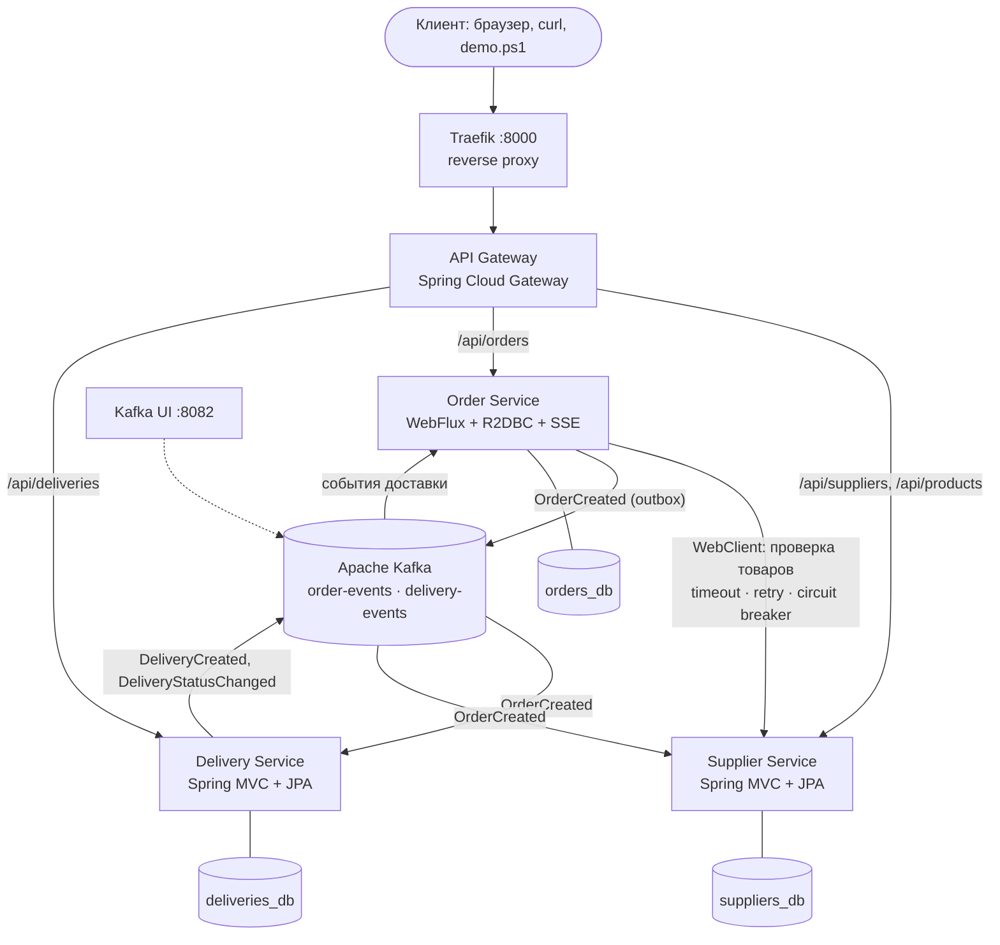
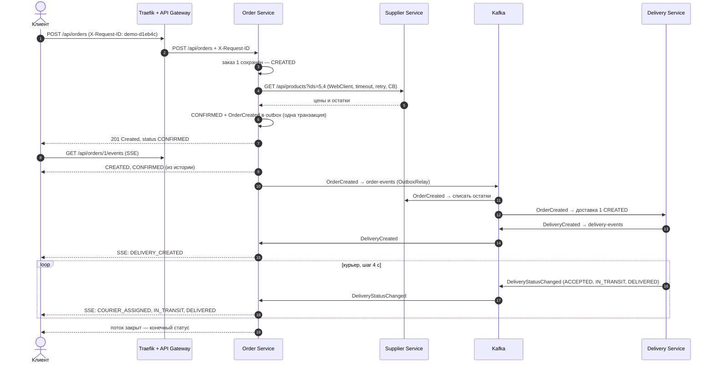

# Практическая работа №8. Микросервисное приложение: поставщики, заказы и доставка

Итоговая работа курса — фрагмент распределённой информационной системы
**поставщиков и доставки** из трёх независимо запускаемых бизнес-сервисов.
Система объединяет технологии предыдущих работ: Docker и Traefik из ПР №5,
статусы доставки из смарт-контракта ПР №6, Spring WebFlux, `Mono`/`Flux`,
SSE и WebClient из ПР №7, модель «поставщик — товар — остаток» из ПР №2–4.
Новое в этой работе — архитектура целиком: API Gateway, отдельная БД
у каждого сервиса, обмен событиями через **Apache Kafka**, обработка отказов
(**Resilience4j**), идемпотентные потребители, сквозной идентификатор запроса
и проверка состояния всей системы.

Репозиторий: [https://github.com/Relax1205/PiRKSP_2](https://github.com/Relax1205/PiRKSP_2) (папка `Практическая работа №8`).

Схема архитектуры отдельно, со всеми диаграммами: [ARCHITECTURE.md](ARCHITECTURE.md).

```
                               Client (браузер, curl, demo.ps1)
                                            │  http://localhost:8000
                                            ▼
                             ┌─────────────────────────────┐
                             │           Traefik           │  внешний reverse proxy (как в ПР №5),
                             │      инфраструктурная       │  dashboard: http://localhost:8081
                             │        маршрутизация        │
                             └──────────────┬──────────────┘
                                            │ любой путь → API Gateway
                                            ▼
                             ┌─────────────────────────────┐
                             │         API Gateway         │  Spring Cloud Gateway: маршрутизация
                             │   маршруты · X-Request-ID   │  внутри приложения, circuit breaker,
                             │  circuit breaker · fallback │  /actuator/health/system, демо-страница
                             └───┬──────────┬──────────┬───┘
       /api/suppliers/**         │          │          │         /api/deliveries/**
       /api/products/**          │          │          │
               ┌─────────────────┘          │          └──────────────────┐
               ▼                            ▼ /api/orders/**              ▼
   ┌───────────────────────┐   WebClient   ┌───────────────────────┐   ┌───────────────────────┐
   │   Supplier Service    │◄──────────────│     Order Service     │   │   Delivery Service    │
   │   Spring MVC + JPA    │ GET товаров:  │ WebFlux + R2DBC + SSE │   │   Spring MVC + JPA    │
   │  поставщики, товары,  │ timeout,      │  заказы, их статусы,  │   │ доставки, курьер,     │
   │  остатки на складе    │ retry, CB     │  поток статусов       │   │ тарифы                │
   └───────────┬───────────┘               └───────────┬───────────┘   └───────────┬───────────┘
               ▼                                       ▼                           ▼
         suppliers_db                              orders_db                 deliveries_db
       (свой PostgreSQL)                       (свой PostgreSQL)           (свой PostgreSQL)

   Асинхронно — через Apache Kafka (контейнер kafka, веб-интерфейс Kafka UI: http://localhost:8082):

     Order Service ──OrderCreated──► [ order-events ] ──┬──► Delivery Service — создать доставку
                                                        └──► Supplier Service — списать остатки
     Delivery Service ──DeliveryCreated, DeliveryStatusChanged──► [ delivery-events ] ──► Order Service
                                                          (новый статус заказа → SSE клиенту)
```

Та же схема в Mermaid (GitHub рисует её картинкой):



## Содержание

1. [Соответствие заданию](#1-соответствие-заданию)
2. [Архитектура](#2-архитектура)
3. [Используемые технологии (подробно)](#3-используемые-технологии-подробно)
4. [Сервисы и API](#4-сервисы-и-api)
5. [Сквозной бизнес-сценарий](#5-сквозной-бизнес-сценарий)
6. [Синхронное взаимодействие: Order → Supplier](#6-синхронное-взаимодействие-order--supplier)
7. [Асинхронное взаимодействие через Kafka](#7-асинхронное-взаимодействие-через-kafka)
8. [Обработка повторных событий (идемпотентность)](#8-обработка-повторных-событий-идемпотентность)
9. [Обработка отказов](#9-обработка-отказов)
10. [Корреляция запросов: X-Request-ID](#10-корреляция-запросов-x-request-id)
11. [Реактивный сценарий: поток статусов заказа (SSE)](#11-реактивный-сценарий-поток-статусов-заказа-sse)
12. [Health checks](#12-health-checks)
13. [Структура проекта](#13-структура-проекта)
14. [Конфигурация через переменные окружения](#14-конфигурация-через-переменные-окружения)
15. [Как запустить и снять скриншоты](#15-как-запустить-и-снять-скриншоты)
16. [Пример вывода demo.ps1](#16-пример-вывода-demops1)
17. [Ответы на возможные вопросы](#17-ответы-на-возможные-вопросы)

## 1. Соответствие заданию

| № | Требование задания                   | Как сделано                                                                                                                                                                                                                                                                                                            | Где смотреть                                                                                      |
| -- | ----------------------------------------------------- | -------------------------------------------------------------------------------------------------------------------------------------------------------------------------------------------------------------------------------------------------------------------------------------------------------------------------------- | ------------------------------------------------------------------------------------------------------------ |
| 1  | Разделение на сервисы              | Три бизнес-сервиса — три отдельных Spring Boot-приложения со своим`pom.xml`, `Dockerfile` и образом: **Supplier** (поставщики и товары), **Order** (заказы), **Delivery** (доставки)                                  | `supplier-service/`, `order-service/`, `delivery-service/`                                             |
| 2  | Собственные данные                   | Три контейнера PostgreSQL:`suppliers_db`, `orders_db`, `deliveries_db`. Каждая БД подключена к отдельной внутренней сети вместе только со «своим» сервисом — чужая БД для сервиса даже не резолвится | [`compose.yaml`](compose.yaml), раздел 2.2                                                            |
| 3  | Единая точка входа                    | API Gateway (Spring Cloud Gateway). У сервисов нет опубликованных портов, клиент видит только Traefik → Gateway                                                                                                                                                                | [`api-gateway/`](api-gateway/), раздел 4.1                                                            |
| 4  | Синхронное взаимодействие     | Создание заказа: Order Service →`GET /api/products?ids=...` в Supplier Service через **WebClient** → проверка наличия → подтверждение заказа                                                                                                                    | [`SupplierClient.java`](order-service/src/main/java/baas/orders/client/SupplierClient.java), раздел 6 |
| 5  | Асинхронное взаимодействие   | **Kafka**: `OrderCreated` → Delivery Service (создаёт доставку) и Supplier Service (списывает остатки); `DeliveryCreated` / `DeliveryStatusChanged` → Order Service. В событиях только нужные поля                                                        | раздел 7                                                                                               |
| 6  | Повторные события                     | Таблица`processed_event` (первичный ключ — `eventId`) + уникальный `order_id` у доставки; в Order Service статус меняется только вперёд. Демонстрация: `POST /api/orders/{id}/republish`                                                  | раздел 8                                                                                               |
| 7  | Обработка отказов                     | Resilience4j:**TimeLimiter** 2 с на попытку, **Retry** 3 попытки, **CircuitBreaker**. В Gateway — таймауты маршрутов и CircuitBreaker с fallback. Transactional outbox на случай недоступности Kafka                                                | раздел 9                                                                                               |
| 8  | Контейнеризация                        | 10 контейнеров одной командой`docker compose up`: Traefik, Gateway, 3 сервиса, 3 БД, Kafka, Kafka UI                                                                                                                                                                                          | [`compose.yaml`](compose.yaml)                                                                              |
| 9  | Маршрутизация                            | Traefik (как в ПР №5) → API Gateway → сервисы                                                                                                                                                                                                                                                                    | раздел 2.1                                                                                             |
| 10 | Health checks                                         | Spring Boot Actuator в каждом сервисе (БД, Kafka, circuit breaker), healthcheck Docker, healthcheck Traefik, сводный**`/actuator/health/system`** в Gateway                                                                                                                                      | раздел 12                                                                                              |
| 11 | Корреляция запросов                 | **X-Request-ID**: Gateway ставит его, сервисы передают дальше в HTTP-заголовке и в **заголовке сообщения Kafka**, каждая строка лога содержит его                                                                             | раздел 10                                                                                              |
| 12 | Реактивный сценарий                 | Order Service целиком на WebFlux + R2DBC;**`GET /api/orders/{id}/events`** — SSE-поток `CREATED → CONFIRMED → DELIVERY_CREATED → COURIER_ASSIGNED → IN_TRANSIT → DELIVERED`                                                                                                                        | раздел 11                                                                                              |
| 13 | Полный бизнес-сценарий            | `demo.ps1` и демо-страница `http://localhost:8000/`                                                                                                                                                                                                                                                             | разделы 5, 15                                                                                         |
| 14 | Проверка отказоустойчивости | `demo.ps1 -Failover` (сервис остановлен), `-Hang` (сервис завис), `-DeliveryDown` (потребитель Kafka остановлен)                                                                                                                                                           | разделы 9.3, 15                                                                                       |

## 2. Архитектура

### 2.1. Компоненты

| Компонент                                                   | Технология               | Доступ снаружи                                     | Хранилище   | За что отвечает                                                                                                                                                                                                 |
| -------------------------------------------------------------------- | ---------------------------------- | --------------------------------------------------------------- | -------------------- | ---------------------------------------------------------------------------------------------------------------------------------------------------------------------------------------------------------------------------- |
| **traefik**                                                    | Traefik v3.6                       | `:8000` — вход в систему, `:8081` — dashboard | —                   | Инфраструктурная маршрутизация: принимает все запросы и отдаёт их API Gateway, проверяет его здоровье, пишет журнал запросов |
| **api-gateway**                                                | Spring Cloud Gateway 4.3 (WebFlux) | только через Traefik                                 | —                   | Маршрутизация внутри приложения по путям`/api/...`, X-Request-ID, circuit breaker с fallback, сводный health, демо-страница                                        |
| **supplier-service**                                           | Spring MVC + Spring Data JPA       | нет                                                          | `suppliers_db`     | Поставщики, товары, цены, остатки; списывает остатки по событию`OrderCreated`                                                                                          |
| **order-service**                                              | Spring WebFlux + Spring Data R2DBC | нет                                                          | `orders_db`        | Создание заказов, проверка товаров у Supplier Service, статусы заказа, SSE-поток статусов                                                                           |
| **delivery-service**                                           | Spring MVC + Spring Data JPA       | нет                                                          | `deliveries_db`    | Доставки: создаёт их по событию`OrderCreated`, имитирует работу курьера, публикует смену статусов                                                    |
| **suppliers-db**, **orders-db**, **deliveries-db** | PostgreSQL 17                      | нет                                                          | тома Docker      | Отдельная БД у каждого сервиса                                                                                                                                                                     |
| **kafka**                                                      | Apache Kafka 3.9 (KRaft)           | нет                                                          | том`kafka-data` | Брокер сообщений: топики`order-events`, `delivery-events`                                                                                                                                           |
| **kafka-ui**                                                   | kafbat Kafka UI 1.5                | `:8082`                                                       | —                   | Просмотр топиков, сообщений, групп потребителей                                                                                                                                     |

**Traefik и API Gateway решают разные задачи.** Traefik знает только
контейнеры и порты: он принимает трафик снаружи и проверяет, жив ли Gateway.
Gateway знает приложение: какой путь в какой сервис ведёт, что делать, если
сервис не отвечает, как пометить запрос идентификатором. Если бы Gateway
запускался в нескольких экземплярах, Traefik распределял бы нагрузку между
ними, как между экземплярами Delivery Service в ПР №5.

### 2.2. Сети Docker и изоляция данных

```
          msa-edge (обычная сеть, есть выход наружу)
   ┌──────────────────────────────────────────────────────┐
   │   traefik            api-gateway           kafka-ui  │
   └──────────────────────────┬──────────────────────┬────┘
          msa-backend (internal: без выхода наружу)  │
   ┌──────────────────────────┴──────────────────────┴────────────────────┐
   │  api-gateway   supplier-service   order-service   delivery-service   │
   │                                                    kafka   kafka-ui  │
   └───────┬─────────────────────┬────────────────────────┬──────────────┘
           │                     │                        │
   msa-suppliers-data    msa-orders-data         msa-deliveries-data      (все internal)
   supplier-service      order-service           delivery-service
   suppliers-db          orders-db               deliveries-db
```

- Наружу опубликованы только порты Traefik (`8000`, `8081`) и Kafka UI (`8082`).
  До сервисов и БД с компьютера напрямую не достучаться.
- Каждая БД находится в своей сети вместе только со своим сервисом. Запрет
  «прямой доступ к таблицам другого сервиса» соблюдается не только
  договорённостью в коде, но и сетью:

```
> docker compose exec delivery-service sh -c "nc -zv -w 2 orders-db 5432; nc -zv -w 2 deliveries-db 5432"
nc: bad address 'orders-db'
deliveries-db (172.22.0.2:5432) open
```

  Delivery Service не может даже найти по имени БД заказов. Данные о заказе
  (получатель, адрес, сумма) он получает только из события `OrderCreated`.

### 2.3. Почему именно такие границы сервисов

| Сервис     | Чем владеет                                                 | Кто может менять эти данные                                            |
| ---------------- | --------------------------------------------------------------------- | --------------------------------------------------------------------------------------------- |
| Supplier Service | поставщики, товары, цены, остатки          | только он сам (по своему API и по событиям)                     |
| Order Service    | заказы, позиции, история статусов         | только он сам; статусы доставки приходят событиями |
| Delivery Service | доставки, курьеры, стоимость доставки | только он сам; заказ «приходит» событием                    |

Каждый сервис — отдельная часть предметной области (bounded context).
Например, цена товара принадлежит Supplier Service. Order Service при
подтверждении заказа копирует её в позицию заказа: цена в оформленном заказе
не должна меняться, даже если поставщик потом её изменит.

## 3. Используемые технологии (подробно)

### Java 21, Maven, Spring Boot 3.5

Все четыре приложения написаны на Java 21 (record-классы, `switch`-выражения,
pattern matching в `instanceof`). Сборка — Maven, но, как и в ПР №5 и №7,
устанавливать JDK и Maven не нужно: jar собирается внутри Docker-образа
(многоэтапный `Dockerfile`: `maven:3.9-eclipse-temurin-21` → `eclipse-temurin:21-jre-alpine`,
непривилегированный пользователь, кэш `~/.m2` между сборками).

Используемые стартеры и библиотеки:

| Зависимость                                       | Где                    | Зачем                                                                                              |
| ------------------------------------------------------------ | ------------------------- | ------------------------------------------------------------------------------------------------------- |
| `spring-cloud-starter-gateway-server-webflux`              | gateway                   | API Gateway на реактивном стеке                                                        |
| `spring-cloud-starter-circuitbreaker-reactor-resilience4j` | gateway                   | фильтр`CircuitBreaker` в маршрутах                                                    |
| `spring-boot-starter-webflux`                              | order                     | WebFlux, Reactor Netty, WebClient, SSE                                                                  |
| `spring-boot-starter-data-r2dbc` + `r2dbc-postgresql`    | order                     | реактивный (неблокирующий) доступ к PostgreSQL                            |
| `spring-boot-starter-web`                                  | supplier, delivery        | Spring MVC, Tomcat                                                                                      |
| `spring-boot-starter-data-jpa` + `postgresql`            | supplier, delivery        | JPA/Hibernate, как в ПР №5                                                                       |
| `spring-kafka`                                             | supplier, order, delivery | `KafkaTemplate`, `@KafkaListener`, создание топиков, обработка ошибок |
| `resilience4j-spring-boot3`, `resilience4j-reactor`      | order                     | TimeLimiter, Retry, CircuitBreaker и их операторы для`Mono`/`Flux`                   |
| `spring-boot-starter-actuator`                             | все                    | `/actuator/health`, группы readiness, свои индикаторы                             |
| `spring-boot-starter-validation`                           | все кроме gateway | Bean Validation тел запросов                                                                 |
| `context-propagation` (Micrometer)                         | gateway, order            | перенос X-Request-ID из Reactor Context в MDC для логов                               |

### Spring Cloud Gateway — API Gateway

**API Gateway** — единая точка входа в приложение. Клиент знает один адрес,
а Gateway по пути запроса решает, в какой сервис его отправить. Spring Cloud
Gateway работает на WebFlux и Reactor Netty: он не держит поток на каждый
запрос, поэтому одновременно проксирует и обычные запросы, и длинные
SSE-потоки.

Основные понятия:

| Понятие                                   | Что это                                                             | В проекте                                                  |
| ------------------------------------------------ | ------------------------------------------------------------------------- | ------------------------------------------------------------------ |
| **Route** (маршрут)                 | id, адрес сервиса (`uri`), условия и фильтры | `order-events`, `orders`, `deliveries`, `suppliers`        |
| **Predicate** (условие)             | когда маршрут срабатывает                          | `Path=/api/orders/**` и др.                                   |
| **Filter** (фильтр маршрута) | обработка запроса и ответа                         | `CircuitBreaker` с `fallbackUri`                              |
| **GlobalFilter**                           | фильтр для всех маршрутов                           | `RequestIdFilter`: X-Request-ID и журнал запросов |
| **metadata**                               | настройки маршрута                                       | `response-timeout`                                               |

Маршруты описаны в `application.yml` (`spring.cloud.gateway.server.webflux.routes`),
список работающих маршрутов виден на `GET /actuator/gateway/routes`.

### Spring WebFlux, Project Reactor, R2DBC — реактивный Order Service

Order Service целиком реактивный: контроллер возвращает `Mono`/`Flux`,
WebClient не блокирует поток при запросе к Supplier Service, а к БД сервис
обращается через **R2DBC** — реактивный драйвер вместо блокирующего JDBC.
В ПР №7 данные хранились в памяти именно потому, что JPA блокирует поток;
здесь эта проблема решена: `OrderRepository extends ReactiveCrudRepository`,
методы возвращают `Mono<Order>` и `Flux<Order>`.

- Таблицы создаются скриптом [`schema.sql`](order-service/src/main/resources/schema.sql)
  (`spring.sql.init.mode=always`): у R2DBC нет автосоздания схемы, как у Hibernate.
- Транзакции — через `TransactionalOperator`: всё, что внутри `tx.transactional(...)`,
  выполняется в одной транзакции БД.
- Сущности — неизменяемые record-классы (`Order`, `OrderItem`, ...), изменение —
  это новый объект, который сохраняется через `save`. `@Version` даёт оптимистическую
  блокировку.

### Spring MVC и Spring Data JPA — Supplier и Delivery Service

Эти сервисы — обычные блокирующие приложения, как Order Service в ПР №5:
`@RestController`, JPA-сущности, `ddl-auto: update`. Реактивность здесь не
нужна: запросы короткие, долгих соединений нет. Микросервисы не обязаны быть
написаны одинаково — каждый выбирает подходящий стек.

### PostgreSQL ×3

У каждого сервиса свой контейнер `postgres:17-alpine`, своя база, свой
пользователь и пароль (`.env`) и свой том Docker. Отказ одной БД затрагивает
только её сервис.

| БД              | Таблицы                                                    |
| ----------------- | ----------------------------------------------------------------- |
| `suppliers_db`  | `supplier`, `product`, `processed_event`                    |
| `orders_db`     | `orders`, `order_items`, `order_status_history`, `outbox` |
| `deliveries_db` | `delivery`, `processed_event`, `outbox_event`               |

### Apache Kafka (KRaft) и Spring for Apache Kafka

**Kafka** — распределённый журнал сообщений. Производитель (producer) дописывает
сообщения в конец **топика**, потребители (consumers) читают их в своём темпе
и запоминают, докуда дочитали (**offset**, смещение). Сообщения не удаляются
после чтения, поэтому один и тот же топик независимо читают несколько
сервисов, а сервис, который был остановлен, после запуска дочитывает всё
пропущенное.

| Понятие                     | Что это                                                                                                                                      | В проекте                                                                                                                        |
| ---------------------------------- | -------------------------------------------------------------------------------------------------------------------------------------------------- | ---------------------------------------------------------------------------------------------------------------------------------------- |
| **Topic**                    | именованный журнал сообщений                                                                                             | `order-events`, `delivery-events`, `*.DLT`                                                                                         |
| **Partition** (раздел) | топик делится на разделы; порядок сообщений гарантируется внутри раздела            | по 3 раздела                                                                                                                    |
| **Key** (ключ)           | раздел выбирается по хэшу ключа                                                                                         | `orderId` — все события одного заказа идут в один раздел и читаются по порядку |
| **Consumer group**           | группа потребителей с общими смещениями; разные группы читают топик независимо | `delivery-service`, `supplier-service`, `order-service`                                                                            |
| **Offset**                   | номер сообщения в разделе; группа фиксирует (commit), докуда обработала                       | фиксируется после обработки каждого сообщения (`ack-mode: record`)                            |
| **Headers**                  | метаданные сообщения                                                                                                            | `X-Request-ID`, `eventType`                                                                                                          |

Kafka работает в режиме **KRaft** — без ZooKeeper, один узел совмещает роли
broker и controller. Топики создают сами сервисы бинами `NewTopic`
(`KafkaConfig`), автосоздание топиков в брокере выключено.

События передаются как **JSON-строка** (`StringSerializer`), а не как общий Java-класс.
У каждого сервиса своё описание события ровно с теми полями, которые ему нужны,
остальные поля Jackson пропускает. Так сервисы не зависят от общей библиотеки
классов и могут развиваться отдельно.

### Kafka UI

Веб-интерфейс [kafbat/kafka-ui](https://github.com/kafbat/kafka-ui) на
[http://localhost:8082](http://localhost:8082): брокер, топики, сообщения с ключами и заголовками,
группы потребителей и их отставание (lag). Нужен для скриншота обмена событиями.

### Resilience4j

Библиотека защиты от отказов. В Order Service используются три механизма
(настройки — `resilience4j.*` в `application.yml`):

- **TimeLimiter** — ограничивает время одной попытки (2 с): зависший сервис
  не держит запрос вечно;
- **Retry** — повторяет неудавшуюся попытку (всего 3 попытки, паузы 200 и 400 мс);
- **CircuitBreaker** — «автомат», который после серии отказов перестаёт
  отправлять запросы и сразу возвращает ошибку:

```
            доля ошибок ≥ 50% (из последних 10 вызовов, минимум 4)
   CLOSED ─────────────────────────────────────────────────────────► OPEN
   запросы идут                                              запросы не отправляются,
      ▲                                                      сразу CallNotPermittedException
      │ 2 пробных запроса успешны                                     │
      │                                                               │ через 15 с
      └──────────────────────── HALF_OPEN ◄───────────────────────────┘
                          2 пробных запроса; если неуспешны — снова OPEN
```

В API Gateway Resilience4j подключён через Spring Cloud CircuitBreaker
(фильтр `CircuitBreaker` в маршрутах).

### Spring Boot Actuator

`/actuator/health` в каждом сервисе показывает состояние компонентов: БД (`db`
или `r2dbc`), Kafka (свой индикатор `KafkaHealthIndicator`), circuit breaker
(в Order Service). Группа **readiness** — то, по чему Docker и Traefik решают,
готов ли контейнер. Gateway дополнительно собирает состояние всех сервисов в
группу **system** (раздел 12).

### Micrometer Context Propagation

В WebFlux один запрос обрабатывают разные потоки, поэтому MDC (ThreadLocal)
для логов «теряется». Решение: X-Request-ID хранится в **Reactor Context**
цепочки, а при `spring.reactor.context-propagation: auto` Reactor сам
восстанавливает MDC из контекста на каждом потоке. Для этого в
`RequestId.registerMdcPropagation()` MDC регистрируется в `ContextRegistry`.

### Traefik v3

Как в ПР №5: Traefik читает метки контейнеров через Docker API. Метки есть
только у API Gateway: один роутер `msa-gateway` с правилом `PathPrefix(/)` и
healthcheck по `/actuator/health/readiness`. Ограничение
``--providers.docker.constraints=Label(`com.docker.compose.project`,`msa-delivery`)``
заставляет Traefik видеть только контейнеры этого проекта: если параллельно
запущена ПР №5, её метки не мешают. Журнал запросов пишется в JSON вместе с
заголовком `X-Request-Id`.

### Docker Compose

Всё описано в [`compose.yaml`](compose.yaml):

- **`build` + `image`** — образы четырёх сервисов собираются из их `Dockerfile`;
- **`environment`** и **`.env`** — адреса, пароли, таймауты, тарифы;
- **`healthcheck`** — у каждого контейнера своя проверка (раздел 12);
- **`depends_on: condition: service_healthy`** — порядок запуска: БД и Kafka →
  сервисы → Gateway;
- **`networks`** — пять сетей, четыре из них `internal` (раздел 2.2);
- **`volumes`** — данные трёх БД и Kafka переживают перезапуск;
- **YAML-якоря** (`x-spring-healthcheck: &spring-healthcheck`) — одна проверка
  на все Spring-сервисы без копирования.

## 4. Сервисы и API

Все запросы — через `http://localhost:8000` (Traefik → API Gateway). Ошибки
во всех сервисах — в формате RFC 7807 Problem Details, как в ПР №5 и №7.

### 4.1. API Gateway

| Маршрут   | Путь                                    | Сервис     | Защита                                                                                           |
| ---------------- | ------------------------------------------- | ---------------- | ------------------------------------------------------------------------------------------------------ |
| `order-events` | `/api/orders/*/events`                    | order-service    | без таймаута ответа и без circuit breaker — это длинный SSE-поток |
| `orders`       | `/api/orders/**`                          | order-service    | CircuitBreaker`orderService`, таймаут ответа 15 с                                      |
| `deliveries`   | `/api/deliveries/**`                      | delivery-service | CircuitBreaker`deliveryService`, таймаут 5 с                                                 |
| `suppliers`    | `/api/suppliers/**`, `/api/products/**` | supplier-service | CircuitBreaker`supplierService`, таймаут 5 с                                                 |

Собственные адреса Gateway:

| Путь                         | Что это                                                                                                                                |
| -------------------------------- | -------------------------------------------------------------------------------------------------------------------------------------------- |
| `GET /`                        | демо-страница: состояние системы, оформление заказа, поток статусов, таблицы |
| `GET /actuator/health/system`  | состояние всех сервисов разом                                                                                      |
| `GET /actuator/gateway/routes` | действующие маршруты                                                                                                      |
| `/fallback/{service}`          | ответ 503, если сервис недоступен (вызывается фильтром CircuitBreaker)                            |

### 4.2. Supplier Service

| Метод и путь        | Что делает                                                                       |
| ----------------------------- | ----------------------------------------------------------------------------------------- |
| `GET /api/products`         | весь каталог: товар, поставщик, цена, остаток         |
| `GET /api/products?ids=5,4` | выбранные товары — так Order Service проверяет наличие |
| `GET /api/products/{id}`    | один товар; 404, если нет                                                 |
| `GET /api/suppliers`        | поставщики с их товарами                                             |
| `GET /api/suppliers/{id}`   | один поставщик; 404, если нет                                         |

При первом запуске загружаются 4 поставщика и 6 товаров. Номера и цены
товаров 1–5 те же, что в ПР №5 и №7 (молоко, хлеб, яблоки, сыр, кофе);
товара 6 «Чай зелёный» нет в наличии — на нём видна ошибка 409.

По событию `OrderCreated` сервис списывает заказанное количество со склада:
после каждого заказа остаток в `GET /api/products` уменьшается.

### 4.3. Order Service

| Метод и путь              | Тип результата         | Что делает                                                                                                    | Коды                |
| ----------------------------------- | ----------------------------------- | ---------------------------------------------------------------------------------------------------------------------- | ----------------------- |
| `POST /api/orders`                | `Mono<ResponseEntity<OrderView>>` | создать заказ                                                                                              | 201, 400, 409, 422, 503 |
| `GET /api/orders`                 | `Flux<OrderView>`                 | все заказы, новые сверху;`?status=DELIVERED` — фильтр                                     | 200                     |
| `GET /api/orders/{id}`            | `Mono<OrderView>`                 | заказ: позиции с ценами, сумма, доставка, курьер                                 | 200, 404                |
| `GET /api/orders/{id}/history`    | `Flux<OrderEvent>`                | история статусов JSON-массивом                                                                  | 200, 404                |
| `GET /api/orders/{id}/events`     | `Flux<ServerSentEvent>`           | **поток статусов (SSE)**                                                                            | 200                     |
| `POST /api/orders/{id}/republish` | `Mono<Map>`                       | повторно отправить`OrderCreated` в Kafka (демонстрация идемпотентности) | 202, 409                |

Тело `POST /api/orders` — цен в нём нет, их сообщает Supplier Service:

```json
{
  "customerName": "Петрова Анна",
  "deliveryAddress": "г. Москва, Ленинский проспект, д. 30к2, кв. 117",
  "comment": "Домофон не работает",
  "items": [ { "productId": 5, "quantity": 1 }, { "productId": 4, "quantity": 1 } ]
}
```

Ответ `201 Created`:

```json
{
  "id": 1, "status": "CONFIRMED", "statusReason": null,
  "customerName": "Петрова Анна", "deliveryAddress": "г. Москва, Ленинский проспект, д. 30к2, кв. 117",
  "comment": "Домофон не работает",
  "items": [
    { "productId": 5, "productName": "Кофе в зёрнах", "supplierName": "ООО «Кофе Импорт»", "price": 1490.00, "quantity": 1, "sum": 1490.00 },
    { "productId": 4, "productName": "Сыр Российский", "supplierName": "ООО «Молочная ферма»", "price": 329.00, "quantity": 1, "sum": 329.00 }
  ],
  "total": 1819.00, "deliveryId": null, "courier": null,
  "createdAt": "2026-10-03T22:57:36", "updatedAt": "2026-10-03T22:57:36"
}
```

Статусы заказа:

```
CREATED ──► CONFIRMED ──► DELIVERY_CREATED ──► COURIER_ASSIGNED ──► IN_TRANSIT ──► DELIVERED
   │            │                │                    │
   ▼            └────────────────┴────────────────────┴──► CANCELLED   (доставку отменили)
REJECTED   (товара нет / нет в каталоге / Supplier Service недоступен)
```

| Статус         | Кто и когда ставит                                                                                                                                   |
| -------------------- | ------------------------------------------------------------------------------------------------------------------------------------------------------------------- |
| `CREATED`          | Order Service: заказ принят и сохранён, идёт проверка у поставщика                                                       |
| `CONFIRMED`        | Order Service: Supplier Service подтвердил наличие, цены зафиксированы, событие`OrderCreated` записано в outbox |
| `DELIVERY_CREATED` | по событию`DeliveryCreated`: Delivery Service создал доставку                                                                              |
| `COURIER_ASSIGNED` | по`DeliveryStatusChanged` со статусом `ACCEPTED`: назначен курьер                                                                     |
| `IN_TRANSIT`       | по`DeliveryStatusChanged` `IN_TRANSIT`: курьер везёт заказ                                                                                    |
| `DELIVERED`        | по`DeliveryStatusChanged` `DELIVERED`: заказ вручён                                                                                                |
| `REJECTED`         | Order Service: заказ отклонён, причина — в поле`statusReason`                                                                           |
| `CANCELLED`        | по`DeliveryStatusChanged` `CANCELLED`                                                                                                                         |

Ошибки создания заказа:

| Ситуация                                                      | Ответ                                                                                                      | Статус заказа          |
| --------------------------------------------------------------------- | --------------------------------------------------------------------------------------------------------------- | ---------------------------------- |
| не заполнены поля, количество < 1            | 400`Ошибка в теле запроса — customerName: укажите получателя; ...`        | заказ не создаётся |
| товара не хватает                                      | 409`Недостаточно товара «Чай зелёный»: заказано 1, на складе 0` | `REJECTED`                       |
| товара нет в каталоге                               | 422`Товар 99 не найден в каталоге Supplier Service`                                     | `REJECTED`                       |
| Supplier Service не отвечает / circuit breaker открыт | 503`Supplier Service недоступен: ...`                                                               | `REJECTED`                       |

В ответе с ошибкой есть номер заказа: `{"title": "Заказ отклонён", "status": 409, "detail": "...", "orderId": 2, "orderStatus": "REJECTED"}`.

### 4.4. Delivery Service

| Метод и путь            | Что делает                              |
| --------------------------------- | ------------------------------------------------ |
| `GET /api/deliveries`           | все доставки, новые сверху |
| `GET /api/deliveries?orderId=1` | доставка заказа                    |
| `GET /api/deliveries/{id}`      | одна доставка; 404, если нет  |

Доставки создаются только по событию `OrderCreated` из Kafka, поэтому API
сервиса — только чтение. Статусы и переходы те же, что в смарт-контракте
ПР №6 и в ПР №7:

```
CREATED ──► ACCEPTED ──► IN_TRANSIT ──► DELIVERED
   │            │
   └────────────┴──► CANCELLED
```

**Имитация курьера.** У доставки есть поле `next_step_at` — когда курьер
сделает следующий шаг. Планировщик (`CourierSimulator`, раз в секунду)
находит доставки, у которых это время подошло, и переводит их на шаг вперёд:
`CREATED → ACCEPTED` (назначается курьер) `→ IN_TRANSIT → DELIVERED`, шаг —
`COURIER_STEP` (4 с). Время хранится в БД, поэтому после перезапуска сервиса
доставки продолжаются с того же места.

Стоимость доставки — тариф из ПР №5: 199 ₽, бесплатно от 1500 ₽.

## 5. Сквозной бизнес-сценарий



Как это выглядит по времени (реальный прогон `demo.ps1`, раздел 16):

| Время          | Что произошло                                                                                                    |
| ------------------- | ---------------------------------------------------------------------------------------------------------------------------- |
| 22:57:35.563        | API Gateway получил`POST /api/orders` с `X-Request-ID: demo-d1eb4c`                                              |
| 22:57:36.290        | Order Service сохранил заказ 1 —`CREATED`                                                                    |
| 22:57:36.776        | Supplier Service проверил наличие: сыр — 40 шт., кофе — 25 шт.                                   |
| 22:57:37.024        | Order Service:`CONFIRMED`, событие `OrderCreated` в outbox; клиенту ушёл `201`                      |
| 22:57:37.419        | OutboxRelay отправил`OrderCreated` в `order-events[0]@0`                                                        |
| 22:57:37.569 / .580 | Supplier и Delivery Service получили одно и то же событие (каждый в своей группе) |
| 22:57:37.709        | Supplier Service списал кофе: остаток 25 → 24                                                              |
| 22:57:38.423        | Delivery Service создал доставку 1, стоимость 0 ₽ (заказ от 1500 ₽)                          |
| 22:57:38.890        | Order Service:`CONFIRMED → DELIVERY_CREATED`, событие ушло в SSE                                              |
| 22:57:43 / 47 / 51  | курьер:`COURIER_ASSIGNED` → `IN_TRANSIT` → `DELIVERED`, SSE-поток закрылся                        |

## 6. Синхронное взаимодействие: Order → Supplier

Order Service не может подтвердить заказ, не узнав цены и остатки, поэтому
здесь нужен ответ «прямо сейчас» — синхронный запрос. Он выполняется
неблокирующим **WebClient** ([`SupplierClient.java`](order-service/src/main/java/baas/orders/client/SupplierClient.java)):

```java
return webClient.get()
        .uri(builder -> builder.path("/api/products").queryParam("ids", idsParam).build())
        .retrieve()
        .bodyToFlux(ProductView.class)
        .collectList()
        .doOnSubscribe(s -> log.info("→ Supplier Service: GET /api/products?ids={}", idsParam))
        .transformDeferred(TimeLimiterOperator.of(timeLimiter))       // не дольше 2 с на попытку
        .transformDeferred(CircuitBreakerOperator.of(circuitBreaker)) // учёт отказов, OPEN — сразу ошибка
        .transformDeferred(RetryOperator.of(retry))                   // до 3 попыток
        .onErrorMap(e -> e instanceof CallNotPermittedException || isFailure.test(e),
                e -> new SupplierUnavailableException(describe(e), e)); // → 503 и REJECTED
```

Порядок создания заказа ([`OrderService.create`](order-service/src/main/java/baas/orders/service/OrderService.java)):

1. Заказ и позиции сохраняются со статусом `CREATED` (транзакция 1).
2. `GET /api/products?ids=5,4` в Supplier Service. **Транзакция БД в это время не открыта**:
   держать соединение с БД, пока ждём другой сервис, нельзя.
3. Проверка: каждый товар есть в каталоге (иначе 422) и его хватает (иначе 409).
4. Позиции получают название, поставщика и цену, считается сумма, статус —
   `CONFIRMED`, событие `OrderCreated` записывается в outbox (транзакция 2).

Повторять запрос безопасно, потому что это `GET`: он ничего не меняет.
Повторяются только **сбои** — таймаут, ошибка соединения, ответ 5xx
([`SupplierFailurePredicate`](order-service/src/main/java/baas/orders/client/SupplierFailurePredicate.java)).
Ответ 4xx — не сбой: сервис жив и ответил, повтор ничего не изменит.

`X-Request-ID` добавляется в запрос автоматически: фильтр WebClient
`RequestId.propagate()` берёт его из Reactor Context текущего запроса.

## 7. Асинхронное взаимодействие через Kafka

### 7.1. Топики, ключи и группы

| Топик                                    | Разделы | Ключ    | Кто пишет                                        | Кто читает (группа)         | События                                                              |
| --------------------------------------------- | -------------- | ----------- | -------------------------------------------------------- | ------------------------------------------ | --------------------------------------------------------------------------- |
| `order-events`                              | 3              | `orderId` | Order Service                                            | `delivery-service`, `supplier-service` | `OrderCreated`                                                            |
| `delivery-events`                           | 3              | `orderId` | Delivery Service                                         | `order-service`                          | `DeliveryCreated`, `DeliveryStatusChanged`                              |
| `order-events.DLT`, `delivery-events.DLT` | 3              | —          | обработчик ошибок потребителя | —                                         | сообщения, которые не удалось обработать |

- **Одно событие — два независимых потребителя.** `OrderCreated` читают
  Delivery Service (создаёт доставку) и Supplier Service (списывает остатки).
  У них разные группы, поэтому каждый получает все сообщения и хранит своё
  смещение. Order Service о них ничего не знает — он просто публикует факт
  «заказ создан».
- **Порядок.** Ключ — номер заказа, поэтому все события одного заказа
  попадают в один раздел и обрабатываются строго по порядку: `IN_TRANSIT`
  не придёт раньше `DeliveryCreated`.

### 7.2. Формат событий

Значение — JSON, метаданные — в заголовках сообщения (вывод
`kafka-console-consumer.sh` с ключом и заголовками):

```
Partition:0  Offset:0  eventType:OrderCreated,X-Request-ID:demo-d1eb4c  1
{"eventId":"c7d16471-91a7-4b34-9e3d-59c4b2c0c4d0","type":"OrderCreated","occurredAt":"2026-10-03T22:57:36",
 "orderId":1,"customerName":"Петрова Анна","deliveryAddress":"г. Москва, Ленинский проспект, д. 30к2, кв. 117",
 "comment":"Домофон не работает","total":1819.00,"items":[{"productId":5,"quantity":1},{"productId":4,"quantity":1}]}

Partition:0  Offset:2  eventType:DeliveryStatusChanged,X-Request-ID:demo-d1eb4c  1
{"eventId":"a0802155-9b06-4163-b756-bd90ba020e33","type":"DeliveryStatusChanged","occurredAt":"2026-10-03T22:57:47",
 "deliveryId":1,"orderId":1,"status":"IN_TRANSIT","courier":"Смирнов Алексей"}
```

**Только необходимые данные.** В `OrderCreated` нет цен позиций, названий
товаров, поставщиков, времени создания заказа. Delivery Service нужны
получатель, адрес, комментарий для курьера и сумма (от неё зависит тариф);
Supplier Service — какие товары и сколько списать. В событиях доставки —
только номер доставки, заказ, новый статус и курьер.

`eventId` — уникальный номер события: по нему потребители отличают повтор
от нового события. `X-Request-ID` — в заголовке, а не в теле: это
служебные метаданные, а не данные о заказе.

### 7.3. Transactional outbox

Проблема «двойной записи»: заказ сохраняется в БД, а событие отправляется
в Kafka. Если записать заказ, а отправка в Kafka не удастся, заказ останется
без доставки. Если сначала отправить, а потом не удастся записать, доставка
появится для несуществующего заказа.

Решение — **transactional outbox**:

```
 Order Service                                             Kafka
 ┌──────────────── одна транзакция БД ────────────────┐
 │ UPDATE orders SET status = 'CONFIRMED' ...          │
 │ INSERT INTO order_status_history ...                │
 │ INSERT INTO outbox (event_id, payload, sent_at=NULL)│
 └─────────────────────────────────────────────────────┘
                     OutboxRelay (раз в 500 мс):
                     SELECT ... FROM outbox WHERE sent_at IS NULL
                     send() ─────────────────────────────────────► order-events
                     UPDATE outbox SET sent_at = now()
```

Событие записывается в ту же транзакцию, что и заказ: либо есть и то, и
другое, либо ничего. Отправку делает отдельный `OutboxRelay`. Если Kafka
недоступна, событие остаётся в таблице и уходит, когда брокер вернётся
(проверено: заказ создан при выключенной Kafka за 0,1 с, событие ушло после
её запуска, доставка создалась).

Так же устроена отправка в Delivery Service (`outbox_event`, `OutboxRelay`
на `@Scheduled`). Supplier Service события не публикует.

У outbox есть следствие: если сервис упадёт между отправкой и отметкой
`sent_at`, событие уйдёт ещё раз. Гарантия доставки — **at-least-once**
(хотя бы один раз), поэтому потребители обязаны быть идемпотентными (раздел 8).

### 7.4. Ошибки при обработке сообщения

`DefaultErrorHandler` (`KafkaConfig` в каждом сервисе): если обработчик
бросил исключение, сообщение обрабатывается ещё 3 раза с паузой 1 с, затем
уходит в **dead letter topic** `<топик>.DLT`, и раздел читается дальше.
Без этого одно «битое» сообщение заблокировало бы все следующие события
раздела. Некорректный JSON сразу отправляется в DLT: повтор его не исправит.

Смещение фиксируется только после успешной обработки (`ack-mode: record`):
если сервис упал посреди обработки, после перезапуска сообщение придёт снова.

## 8. Обработка повторных событий (идемпотентность)

Повторная доставка — нормальная ситуация для Kafka: перезапуск потребителя
до фиксации смещения, перебалансировка группы, повторная отправка из outbox.
Повторное `OrderCreated` не должно создать вторую доставку и второй раз
списать товар.

**Delivery Service** ([`DeliveryService.createFor`](delivery-service/src/main/java/baas/delivery/service/DeliveryService.java)) —
защита в два уровня, всё в одной транзакции:

```java
if (processedEvents.existsById(event.eventId())) {          // 1) это сообщение уже обработано
    log.warn("Повторное событие {} ... доставка повторно не создаётся", ...);
    return;
}
Optional<Delivery> existing = deliveries.findByOrderId(event.orderId());   // 2) у заказа уже есть доставка
if (existing.isEmpty()) {
    Delivery delivery = deliveries.save(new Delivery(...));               // order_id — UNIQUE
    outbox.add(DeliveryEvent.of(DeliveryEvent.CREATED, delivery), requestId);
}
processedEvents.save(new ProcessedEvent(event.eventId(), event.type(), event.orderId()));
```

1. Таблица `processed_event`, первичный ключ — `eventId`. Повтор того же
   сообщения пропускается. Если два экземпляра обработают одно событие
   одновременно, второй упрётся в первичный ключ, транзакция откатится, а при
   повторной обработке сработает проверка 1.
2. Уникальный `order_id` у доставки — защита по бизнес-ключу: даже событие
   с другим `eventId` для того же заказа второй доставки не создаст.

**Supplier Service** ([`StockService.writeOff`](supplier-service/src/main/java/baas/supplier/service/StockService.java)) —
та же таблица `processed_event`: списание и отметка — одна транзакция.

**Order Service** — другой способ: статус заказа меняется **только вперёд**
([`OrderStatus.canMoveTo`](order-service/src/main/java/baas/orders/domain/OrderStatus.java)).
Повторное `IN_TRANSIT` для заказа в `IN_TRANSIT` или запоздавшее
`DELIVERY_CREATED` для заказа в `DELIVERED` ничего не меняют:

```
order-service-1 | ← Kafka delivery-events[0]@4: DeliveryCreated — доставка 1 заказа 1, статус CREATED
order-service-1 | Заказ 1 уже в статусе DELIVERED: событие DeliveryCreated (CREATED) статус не меняет — повтор или устаревшее событие
```

Так это проверялось: то же сообщение `DeliveryCreated` (тот же ключ и JSON)
отправлено в топик ещё раз консольным producer'ом Kafka — заказ остался
`DELIVERED`, история статусов не изменилась:

```powershell
# без BOM: иначе Windows PowerShell допишет его в начало ключа сообщения
[Console]::InputEncoding = New-Object System.Text.UTF8Encoding $false
'1|{"eventId":"8a9b030a-8eb8-46a7-9285-5f2a049eed71","type":"DeliveryCreated","deliveryId":1,"orderId":1,"status":"CREATED","courier":null}' |
    docker compose exec -T kafka /opt/kafka/bin/kafka-console-producer.sh --bootstrap-server localhost:9092 --topic delivery-events --property parse.key=true --property "key.separator=|"
```

(`1|` — ключ сообщения, номер заказа; `eventId` возьмите из своего топика
`delivery-events` — в Kafka UI или командой из раздела 15.)

**Проверка.** `POST /api/orders/{id}/republish` сбрасывает `sent_at` у события
`OrderCreated` в outbox — OutboxRelay отправляет **то же сообщение с тем же
`eventId`** ещё раз. Так выглядит повторная доставка:

```
order-service-1    | → Kafka order-events[0]@1: OrderCreated заказа 1 (eventId c7d16471-...)
delivery-service-1 | ← Kafka order-events[0]@1: OrderCreated заказа 1 (eventId c7d16471-...)
supplier-service-1 | ← Kafka order-events[0]@1: OrderCreated заказа 1 (eventId c7d16471-...)
delivery-service-1 | WARN DeliveryService : Повторное событие c7d16471-... (OrderCreated, заказ 1) уже обработано — доставка повторно не создаётся
supplier-service-1 | WARN StockService    : Повторное событие c7d16471-... (OrderCreated, заказ 1) уже обработано — товары повторно не списываются
```

Сообщение действительно пришло второй раз (смещение `@1`), но доставка у
заказа по-прежнему одна, остаток не изменился.

## 9. Обработка отказов

### 9.1. Order Service → Supplier Service

| Механизм                      | Настройка                                            | Значение                                             | Зачем                                                                                  |
| ------------------------------------- | ------------------------------------------------------------- | ------------------------------------------------------------ | ------------------------------------------------------------------------------------------- |
| Таймаут подключения | `supplier-service.connect-timeout`                          | 1 с                                                         | хост не принимает соединение                                       |
| **TimeLimiter**                 | `resilience4j.timelimiter...timeout-duration`               | 2 с на попытку                                     | сервис принял соединение, но не отвечает                  |
| **Retry**                       | `max-attempts`, `wait-duration`, экспонента     | 3 попытки, паузы 200 и 400 мс                 | кратковременный сбой (перезапуск, сеть)                    |
| **CircuitBreaker**              | окно 10 вызовов, минимум 4, порог 50 % | открыт 15 с, затем 2 пробных вызова | сервис лежит — не тратить время и не нагружать его |
| Что считается сбоем  | `SupplierFailurePredicate`                                  | таймаут, ошибка соединения, 5xx       | 4xx — не сбой                                                                        |

**Порядок обёрток:** `Retry( CircuitBreaker( TimeLimiter( HTTP-запрос ) ) )`.
Таймаут ограничивает каждую попытку. Circuit breaker учитывает каждую
попытку. Retry повторяет попытки, но не повторяет `CallNotPermittedException`:
если автомат открыт, ждать бессмысленно — ответ нужен сразу. Это порядок,
который Resilience4j использует по умолчанию для аннотаций.

Худший случай, когда Supplier Service «завис»: 3 попытки × 2 с + паузы
0,6 с ≈ **6,6 с**, потом — 503. Дольше запрос висеть не может. Когда автомат
открылся, отказ приходит за **~0,05 с**.

### 9.2. API Gateway

- **Таймауты ответа:** 5 с для каталога и доставок, 15 с для заказов (дольше,
  чем Order Service ждёт Supplier Service со всеми повторами), без таймаута
  для SSE-потока. Таймаут подключения — 2 с.
- **CircuitBreaker в маршрутах** (`orderService`, `deliveryService`,
  `supplierService`) с `fallbackUri: forward:/fallback/...` — если сервис не
  отвечает, клиент получает понятный 503 ([`FallbackController`](api-gateway/src/main/java/baas/gateway/web/FallbackController.java)):

```json
{"type":"about:blank","title":"Service Unavailable","status":503,
 "detail":"Сервис supplier-service временно недоступен: сервис не найден в сети (контейнер остановлен?)",
 "instance":"/api/products","service":"supplier-service","requestId":"fail-5b3fec"}
```

Без fallback Gateway вернул бы 500 со стектрейсом.

### 9.3. Сценарии отказов (проверены)

| Что сломано                                                     | Как воспроизвести             | Поведение системы                                                                                                                                                                                                                                                                                                                                                                                                                                                     | После восстановления                                                                                                                                                                          |
| ------------------------------------------------------------------------- | --------------------------------------------- | ------------------------------------------------------------------------------------------------------------------------------------------------------------------------------------------------------------------------------------------------------------------------------------------------------------------------------------------------------------------------------------------------------------------------------------------------------------------------------------- | ---------------------------------------------------------------------------------------------------------------------------------------------------------------------------------------------------------------- |
| **Supplier Service остановлен**                           | `demo.ps1 -Failover`                        | `POST /api/orders` → 503 меньше чем за 1 с (быстрые неудачные попытки: имя контейнера не находится в DNS), дальше circuit breaker открыт → 503 за ~0,1 с; заказы — `REJECTED` с причиной. `GET /api/orders` и доставки работают. Каталог через Gateway — 503 за 1 с. Health: `supplierService DOWN`, у Order Service `supplierService: OPEN` | контейнер проходит healthcheck (~20 с), автомат через 15 с →`HALF_OPEN` → пробный запрос успешен → `CLOSED`, заказы снова `201 CONFIRMED` |
| **Supplier Service завис** (процесс заморожен) | `demo.ps1 -Hang` (`docker compose pause`) | 1-й заказ: 3 попытки по 2 с → 503 за 6,5 с; 2-й: автомат открылся → 2,2 с; 3-й → 0,07 с                                                                                                                                                                                                                                                                                                                                                      | `unpause`, через 15 с автомат пропускает пробные запросы → `201`                                                                                                       |
| **Delivery Service остановлен**                           | `demo.ps1 -DeliveryDown`                    | заказы создаются как обычно (`201 CONFIRMED` за 0,1 с): Order Service не ждёт Delivery Service. `OrderCreated` ждёт в Kafka, у группы `delivery-service` LAG = 1                                                                                                                                                                                                                                                                   | после запуска сервис дочитывает пропущенное: доставка создаётся, SSE получает`DELIVERY_CREATED ... DELIVERED`                                  |
| **Kafka остановлена**                                    | `docker compose stop kafka`                 | заказы создаются (`201 CONFIRMED`), события копятся в outbox, в логах `Kafka недоступна: события остаются в outbox`. Health: у всех сервисов `kafka: DOWN`, `db: UP`                                                                                                                                                                                                                               | `start kafka` → OutboxRelay отправляет накопленное, доставка создаётся через ~8 с                                                                                 |
| **Order Service остановлен**                              | `docker compose stop order-service`         | `/api/orders` → 503 от Gateway; каталог и доставки работают; события доставки копятся в `delivery-events`                                                                                                                                                                                                                                                                                                                       | дочитывает события, статусы заказов догоняют доставки                                                                                                             |

### 9.4. Мелочи, без которых отказоустойчивость не работала бы

- **Кэш DNS.** Встроенный DNS Docker отдаёт адреса контейнеров с TTL 600 с,
  и Netty (WebClient, Gateway) кэширует их на это время. Если контейнер
  перезапустится с другим IP, клиент 10 минут ходил бы по старому адресу.
  Кэш ограничен 10 секундами (`DnsCacheConfig`, `WebClientConfig`).
- **Время ответа DNS.** У Gateway есть сеть с выходом наружу, поэтому имя
  остановленного контейнера DNS Docker пересылает внешнему DNS и ждёт до 5 с.
  Запрос к DNS ограничен 1 секундой.
- **Health не должен зависать.** Проверка Kafka в сервисах укладывается
  в ~1 с, Gateway ждёт каждый сервис не дольше 3 с. Иначе при выключенной
  Kafka Gateway показал бы сами сервисы как недоступные.
- **Readiness без внешних зависимостей.** Docker и Traefik проверяют группу
  `readiness` (запущен + есть связь со своей БД). Недоступность Kafka или
  Supplier Service не делает Order Service «нездоровым»: он продолжает
  принимать запросы, а оркестратор (Kubernetes, Docker Swarm) не стал бы
  перезапускать работающий сервис из-за чужого сбоя.

## 10. Корреляция запросов: X-Request-ID

```
Client ──X-Request-ID: demo-d1eb4c──► Traefik  (access log: "request_X-Request-Id":"demo-d1eb4c")
                                         │
                                         ▼
                                    API Gateway   RequestIdFilter: взять из запроса или сгенерировать,
                                         │        передать в сервис, вернуть в ответе, записать в лог
                                         ▼  заголовок X-Request-ID
                                   Order Service  RequestIdWebFilter → Reactor Context → MDC
                                    │        │
           WebClient-фильтр: заголовок       │  outbox.request_id → заголовок сообщения Kafka
                                    ▼        ▼
                        Supplier Service    Kafka ──► Delivery / Supplier Service: заголовок → MDC
                        (RequestIdFilter)              │
                                                       │ delivery.request_id — сохраняется в доставке
                                                       ▼
                               шаги курьера и события доставки идут с тем же X-Request-ID
                                                       │
                                                       ▼
                                 Kafka ──► Order Service: заголовок → MDC
```

- **Gateway** берёт `X-Request-ID` из запроса клиента (если он корректный:
  буквы, цифры, `._:-`, до 64 символов) или генерирует новый и передаёт его
  сервису. Клиент получает его в заголовке ответа.
- **Сервисы** кладут его в MDC; шаблон лога во всех сервисах одинаковый:
  `%d{HH:mm:ss.SSS} %5p [%X{requestId}] [поток] логгер : сообщение`.
- **HTTP между сервисами** — фильтр WebClient добавляет заголовок.
- **Kafka** — `X-Request-ID` записывается в outbox вместе с событием и уходит
  в заголовке сообщения; потребитель достаёт его и кладёт в MDC.
- **Отложенная работа** — Delivery Service хранит `request_id` в доставке,
  поэтому даже шаги курьера через 4, 8, 12 секунд пишутся в лог с тем же
  идентификатором.

Итог: по одному идентификатору видна вся жизнь заказа — от HTTP-запроса
до вручения. Команда:

```powershell
docker compose logs --timestamps | Select-String demo-d1eb4c
```

(в `demo.ps1` строки ещё и сортируются по времени Docker, см. блок 7 в разделе 16).

## 11. Реактивный сценарий: поток статусов заказа (SSE)

`GET /api/orders/{id}/events` — Server-Sent Events, как в ПР №7: один
GET-запрос, сервер не закрывает соединение и дописывает события по мере
их появления:

```
id:3
event:DELIVERY_CREATED
data:{"seq":3,"orderId":1,"status":"DELIVERY_CREATED","details":"Delivery Service создал доставку 1","at":"2026-10-03T22:57:38"}
```

Откуда берутся события. Каждое изменение статуса записывается в таблицу
`order_status_history`, а после коммита публикуется в `OrderEventBus` —
горячий поток на `Sinks.many().multicast()` (как `DeliveryEventBus` в ПР №7).

**Главная тонкость — не потерять событие.** Клиент подписывается на поток
уже после создания заказа, а `DELIVERY_CREATED` приходит через ~1–2 с — то
есть может случиться прямо в момент подписки. Если сначала прочитать
историю, а потом подписаться на шину, событие между этими шагами пропадёт,
и поток никогда не дойдёт до конечного статуса. Поэтому порядок обратный
([`OrderService.events`](order-service/src/main/java/baas/orders/service/OrderService.java)):

```java
Flux<OrderEvent> live = eventBus.events()
        .filter(event -> event.orderId() == orderId)
        .replay()                                   // 1) подписка на шину сразу, события копятся
        .autoConnect(0, liveConnection::set);
return history.findByOrderIdOrderById(orderId)      // 2) потом история из БД
        .map(OrderEvent::of)
        .collectList()
        .flatMapMany(past -> {
            long lastSeq = past.isEmpty() ? 0 : past.getLast().seq();
            return Flux.fromIterable(past)          // 3) сначала история,
                    .concatWith(live.filter(event -> event.seq() > lastSeq)); // затем новое без повторов
        })
        .takeUntil(OrderEvent::isFinal)             // 4) DELIVERED / REJECTED / CANCELLED — конец потока
        .filter(event -> event.seq() > afterSeq)    //    Last-Event-ID: только то, чего клиент не видел
        .doFinally(signal -> liveConnection.get().dispose());   // 5) отписка от шины (в коде — с проверкой на null)
```

`seq` — номер записи истории; он же поле `id:` в SSE. Браузерный `EventSource`
при обрыве соединения переподключается сам и присылает `Last-Event-ID` —
сервер отдаёт только новые события.

Контроллер ([`OrderController.events`](order-service/src/main/java/baas/orders/web/OrderController.java))
добавляет **keep-alive**: если 15 с нет событий, уходит SSE-комментарий
`:keep-alive`, чтобы прокси не закрыли «молчащее» соединение
(виден в выводе `demo.ps1 -DeliveryDown`). Ошибка (нет заказа) приходит
событием `event:error` — статус SSE-ответа уже `200`, поменять его нельзя
(как в ПР №7).

Операторы Reactor в Order Service:

| Оператор                                       | Где                                                                                              | Что делает                                    |
| ------------------------------------------------------ | --------------------------------------------------------------------------------------------------- | ------------------------------------------------------ |
| `flatMap`                                            | создание заказа: заказ → запрос к Supplier → подтверждение | асинхронный следующий шаг       |
| `transformDeferred`                                  | `SupplierClient`                                                                                  | обёртки Resilience4j вокруг`Mono`       |
| `onErrorResume`                                      | `SupplierUnavailableException` → заказ `REJECTED`                                         | запасная ветка при ошибке        |
| `onErrorMap`                                         | ошибки WebClient →`SupplierUnavailableException`                                           | одна ошибка в другую                  |
| `switchIfEmpty`                                      | нет заказа → 404                                                                          | что делать при пустом`Mono`        |
| `deferContextual`, `contextWrite`                  | X-Request-ID в Reactor Context                                                                     | данные запроса без ThreadLocal         |
| `replay().autoConnect(0)`                            | SSE: буфер событий до чтения истории                                     | горячий поток без потерь          |
| `concatWith`, `takeUntil`, `merge`, `interval` | SSE: история + новые события, конец потока, keep-alive                | сборка потока                              |
| `concatMap`                                          | OutboxRelay: события по одному, по порядку                                  | сохраняет порядок                      |
| `subscribeOn(boundedElastic)`                        | OutboxRelay:`KafkaTemplate.send` может ждать метаданные                       | блокирующий вызов не на event loop |

**Где здесь `block()`.** Один раз — в `DeliveryEventsListener`:
`@KafkaListener` работает в собственном потоке Kafka-консьюмера, а не на
event loop Netty, и должен дождаться, пока статус заказа запишется в БД, —
только после этого Kafka фиксирует смещение. В обработке HTTP-запросов
`block()` нет.

## 12. Health checks

| Где                                             | Что проверяется                                                                                                                                  | Кто использует                                        |
| -------------------------------------------------- | -------------------------------------------------------------------------------------------------------------------------------------------------------------- | ------------------------------------------------------------------ |
| `/actuator/health` каждого сервиса | `db` / `r2dbc`, `kafka` (свой `KafkaHealthIndicator`), `circuitBreakers` (Order Service), диск                                               | Gateway (`/actuator/health/system`)                              |
| `/actuator/health/readiness`                     | запущен + есть связь со своей БД                                                                                                      | `healthcheck` Docker, Traefik (для Gateway)                   |
| `healthcheck` в `compose.yaml`                | Spring-сервисы —`wget` readiness; PostgreSQL — `pg_isready`; Kafka — `kafka-broker-api-versions.sh`; Traefik — `traefik healthcheck --ping` | `docker compose ps` (`healthy`), порядок запуска |
| `/actuator/health/system` в Gateway             | все три сервиса: статус, время ответа, их БД, Kafka, состояние circuit breaker                                      | человек, демо-страница,`demo.ps1`             |

`GET http://localhost:8000/actuator/health/system`, когда Supplier Service остановлен:

```json
{
  "status": "DOWN",
  "components": {
    "deliveryService": { "status": "UP",
      "details": { "url": "http://delivery-service:8080", "responseTimeMs": 14, "db": "UP", "kafka": "UP" } },
    "orderService": { "status": "UP",
      "details": { "url": "http://order-service:8080", "responseTimeMs": 13, "r2dbc": "UP", "kafka": "UP",
                   "circuitBreakers": "supplierService: OPEN" } },
    "supplierService": { "status": "DOWN",
      "details": { "url": "http://supplier-service:8080", "error": "сервис не найден в сети (контейнер остановлен?)" } }
  }
}
```

Сводный health — отдельная группа `system`. В группу `readiness` Gateway
она не входит: остановка одного сервиса не делает Gateway «нездоровым»,
и Traefik не убирает его из маршрутизации.

**Демо-страница** [http://localhost:8000/](http://localhost:8000/) показывает ту же таблицу и
обновляет её каждые 3 с. Ещё на странице: оформление заказа (с выбором
товаров из каталога), лента SSE-событий, таблицы заказов, каталога и
доставок. `http://localhost:8000/#order=1` — сразу открыть поток заказа 1.

## 13. Структура проекта

```
Практическая работа №8/
├── compose.yaml                 вся система: traefik, api-gateway, 3 сервиса, 3 PostgreSQL, kafka, kafka-ui
├── .env                         порты, БД и пароли, таймауты, тарифы, шаг курьера
├── demo.ps1                     сценарии для скриншотов: основной, -Failover, -Hang, -DeliveryDown
├── requests.http                запросы для VS Code REST Client / IntelliJ HTTP Client
├── README.md
│
├── api-gateway/                 Spring Cloud Gateway (WebFlux)
│   └── src/main/
│       ├── java/baas/gateway/
│       │   ├── web/RequestIdFilter.java          GlobalFilter: X-Request-ID, журнал запросов
│       │   ├── web/FallbackController.java       503 Problem Details, если сервис недоступен
│       │   ├── health/DownstreamHealthIndicator  состояние сервиса по его /actuator/health
│       │   ├── health/SystemHealthConfig         группа system: order, supplier, delivery
│       │   └── config/                           RequestId (MDC ↔ Reactor Context), DnsCacheConfig, Failures
│       └── resources/
│           ├── application.yml                   маршруты, таймауты, circuit breaker, health-группы
│           └── static/index.html                 демо-страница
│
├── supplier-service/            Spring MVC + JPA, suppliers_db
│   └── src/main/java/baas/supplier/
│       ├── domain/              Supplier, Product (остаток, writeOff), ProcessedEvent
│       ├── web/                 ProductController (/api/products?ids=...), SupplierController, Dto
│       ├── messaging/           OrderEventsListener (группа supplier-service), OrderCreatedEvent
│       ├── service/StockService списание остатков — идемпотентно
│       └── config/              RequestId + RequestIdFilter, KafkaConfig (топики, DLT), KafkaHealthIndicator, DemoDataLoader
│
├── order-service/               Spring WebFlux + R2DBC, orders_db
│   └── src/main/
│       ├── java/baas/orders/
│       │   ├── domain/          Order, OrderItem, OrderStatus (переходы только вперёд), OrderStatusChange, OutboxEvent
│       │   ├── repository/      реактивные репозитории R2DBC
│       │   ├── client/          SupplierClient (WebClient + Resilience4j), SupplierFailurePredicate, ProductView
│       │   ├── service/         OrderService (создание, события доставки, SSE), OrderEventBus (Sinks), OrderEvent
│       │   ├── messaging/       OutboxRelay → Kafka, DeliveryEventsListener ← Kafka, OrderCreatedEvent, DeliveryEvent
│       │   ├── web/             OrderController (REST + SSE), Dto, ErrorHandler
│       │   └── config/          RequestId, RequestIdWebFilter, WebClientConfig, KafkaConfig, KafkaHealthIndicator
│       └── resources/
│           ├── application.yml  R2DBC, Kafka, resilience4j.*, health-группы
│           └── schema.sql       orders, order_items, order_status_history, outbox
│
└── delivery-service/            Spring MVC + JPA, deliveries_db
    └── src/main/java/baas/delivery/
        ├── domain/              Delivery (order_id UNIQUE, next_step_at), DeliveryStatus, ProcessedEvent, OutboxEvent
        ├── messaging/           OrderEventsListener (группа delivery-service), Outbox, OutboxRelay, события
        ├── service/             DeliveryService (идемпотентное создание, шаги курьера), CourierSimulator
        ├── web/                 DeliveryController (только чтение)
        └── config/              DeliveryProperties (тарифы, курьеры), KafkaConfig, RequestId, RequestIdFilter, ...
```

Небольшие служебные классы (`RequestId`, `KafkaHealthIndicator`) есть в
нескольких сервисах. Это сделано намеренно: общая библиотека связала бы
сервисы — изменение в ней требовало бы пересобрать и выкатить все сразу.

## 14. Конфигурация через переменные окружения

В исходном коде нет адресов и паролей: в `application.yml` — плейсхолдеры
`${...}`, значения — в `compose.yaml` и `.env` (Docker Compose читает `.env`
автоматически).

| Переменная                                | По умолчанию | Назначение                                                                          |
| --------------------------------------------------- | ----------------------- | --------------------------------------------------------------------------------------------- |
| `HTTP_PORT`                                       | `8000`                | вход в систему (Traefik). 80 и 8080 заняты ПР №5, 8090/8091 — ПР №7 |
| `TRAEFIK_DASHBOARD_PORT`                          | `8081`                | dashboard Traefik                                                                             |
| `KAFKA_UI_PORT`                                   | `8082`                | Kafka UI                                                                                      |
| `TZ`                                              | `Europe/Moscow`       | часовой пояс контейнеров                                                |
| `SUPPLIERS_DB`, `_USER`, `_PASSWORD`          | `suppliers_db` ...    | БД Supplier Service                                                                         |
| `ORDERS_DB`, `_USER`, `_PASSWORD`             | `orders_db` ...       | БД Order Service                                                                            |
| `DELIVERIES_DB`, `_USER`, `_PASSWORD`         | `deliveries_db` ...   | БД Delivery Service                                                                         |
| `SUPPLIER_TIMEOUT`                                | `2s`                  | TimeLimiter: таймаут одной попытки запроса к Supplier Service      |
| `SUPPLIER_RETRY_ATTEMPTS`                         | `3`                   | всего попыток (1 + 2 повтора)                                              |
| `SUPPLIER_CB_OPEN_STATE`                          | `15s`                 | сколько circuit breaker остаётся открытым                              |
| `DELIVERY_BASE_COST`, `DELIVERY_FREE_THRESHOLD` | `199`, `1500`       | тариф доставки                                                                   |
| `COURIER_STEP`                                    | `4s`                  | шаг имитации курьера                                                        |

Внутренние адреса (`http://supplier-service:8080`, `kafka:9092`,
`r2dbc:postgresql://orders-db:5432/orders_db`) заданы в `compose.yaml`:
контейнеры находят друг друга по имени через DNS Docker.

## 15. Как запустить и снять скриншоты

Нужен только **Docker Desktop** (запущен, `docker info` без ошибок). JDK и
Maven не нужны. Интернет нужен при первой сборке (образы и Maven-зависимости).
Порты **8000, 8081, 8082** должны быть свободны (иначе поменяйте их в `.env`).
Системе нужно ~2,5 ГБ памяти Docker.

### Шаг 1. Запустить систему

```powershell
cd "C:\Users\relax\Documents\PiRKSP_2\Практическая работа №8"
docker compose up --build
```

Первая сборка — несколько минут, повторный запуск с нуля — около 2 минут
(Kafka → сервисы → Gateway). Контейнеры стартуют по очереди согласно
`depends_on` и healthcheck:

```
 Container msa-delivery-kafka-1             Healthy
 Container msa-delivery-orders-db-1         Healthy
 Container msa-delivery-order-service-1     Started
 Container msa-delivery-supplier-service-1  Started
 Container msa-delivery-delivery-service-1  Started
 Container msa-delivery-order-service-1     Healthy
 Container msa-delivery-supplier-service-1  Healthy
 Container msa-delivery-delivery-service-1  Healthy
 Container msa-delivery-api-gateway-1       Started
```

Это окно лучше оставить открытым — в нём идут логи. Для остальных команд
откройте второе окно PowerShell в той же папке. Запуск в фоне:
`docker compose up --build -d`.

Если в ПР №5 уже запущен Traefik на порту 80, ничего делать не нужно: эта
система работает на 8000 и не видит контейнеры ПР №5.

### Шаг 2. Проверить контейнеры

```powershell
docker compose ps
```

```
NAME                              STATUS
msa-delivery-api-gateway-1        Up 38 seconds (healthy)
msa-delivery-deliveries-db-1      Up About a minute (healthy)
msa-delivery-delivery-service-1   Up About a minute (healthy)
msa-delivery-kafka-1              Up About a minute (healthy)
msa-delivery-kafka-ui-1           Up About a minute
msa-delivery-order-service-1      Up About a minute (healthy)
msa-delivery-orders-db-1          Up About a minute (healthy)
msa-delivery-supplier-service-1   Up About a minute (healthy)
msa-delivery-suppliers-db-1       Up About a minute (healthy)
msa-delivery-traefik-1            Up About a minute (healthy)
```

Все контейнеры, кроме Kafka UI (у него нет healthcheck), должны быть `(healthy)`.

### Шаг 3. Прогнать сквозной сценарий

```powershell
powershell -ExecutionPolicy Bypass -File .\demo.ps1
```

Скрипт по блокам (вывод — в разделе 16):

0. `docker compose ps`;
1. состояние сервисов (`/actuator/health/system`);
2. каталог Supplier Service;
3. создание заказа → `201 CONFIRMED`, позиции с ценами поставщиков;
4. **SSE-поток статусов** — события приходят с паузами, с отметкой времени;
5. итог: заказ `DELIVERED`, доставка, остаток на складе уменьшился;
6. **идемпотентность**: повторное `OrderCreated` ничего не меняет;
7. **трассировка** запроса по X-Request-ID через все контейнеры;
8. ошибки 409, 422, 400.

Скрипт можно запускать повторно — каждый раз создаётся новый заказ.

То же самое можно показать в браузере: [http://localhost:8000/](http://localhost:8000/) → «Оформить
заказ» → лента статусов справа заполняется сама.

### Шаг 4. Kafka

- **Kafka UI** [http://localhost:8082](http://localhost:8082) → **Topics** → `order-events` → **Messages**:
  сообщения `OrderCreated` с ключом (номер заказа), значением (JSON) и
  заголовками `X-Request-ID`, `eventType`. Так же `delivery-events`.
- **Consumers**: группы `delivery-service`, `supplier-service`, `order-service`,
  состояние `STABLE`, отставание (lag) 0.
- Или в консоли:

```powershell
docker compose exec kafka /opt/kafka/bin/kafka-console-consumer.sh --bootstrap-server localhost:9092 --topic order-events --from-beginning --max-messages 3 --timeout-ms 5000 --property print.key=true --property print.headers=true --property print.partition=true --property print.offset=true
docker compose exec kafka /opt/kafka/bin/kafka-consumer-groups.sh --bootstrap-server localhost:9092 --describe --all-groups
```

### Шаг 5. Отказы

```powershell
powershell -ExecutionPolicy Bypass -File .\demo.ps1 -Failover       # Supplier Service остановлен и запущен снова
powershell -ExecutionPolicy Bypass -File .\demo.ps1 -Hang           # Supplier Service завис (pause/unpause)
powershell -ExecutionPolicy Bypass -File .\demo.ps1 -DeliveryDown   # Delivery Service остановлен: событие ждёт в Kafka
```

Каждый сценарий сам возвращает систему в рабочее состояние.

Во время `-Failover` хорошо видно и демо-страницу: строка Supplier Service
становится `DOWN`, у Order Service — `supplierService: OPEN`, а после
восстановления — снова `UP` и `CLOSED`.

### Шаг 6. Что именно скриншотить

| Требование к отчёту                                                                             | Что снять                                                                                                                                                                                                                                                                                                                                                                                                                                                                                                                                                                                                                                           |
| ---------------------------------------------------------------------------------------------------------------- | ----------------------------------------------------------------------------------------------------------------------------------------------------------------------------------------------------------------------------------------------------------------------------------------------------------------------------------------------------------------------------------------------------------------------------------------------------------------------------------------------------------------------------------------------------------------------------------------------------------------------------------------------------------- |
| 3–5 скриншотов полного сценария                                                        | ①`demo.ps1`, блоки 2–3: каталог и созданный заказ `201 CONFIRMED` с ценами; ② блок 4: SSE-события с разными метками времени до `DELIVERED`; ③ блоки 5–6: доставка `DELIVERED`, остаток уменьшился, повтор события ничего не изменил; ④ демо-страница [http://localhost:8000/](http://localhost:8000/) после оформления заказа: лента статусов, таблицы заказов и доставок; ⑤ (по желанию) блок 8 — ошибки 409/422/400 |
| работающие контейнеры                                                                        | `docker compose ps` (блок 0 `demo.ps1` или шаг 2) — все `healthy`; можно добавить [http://localhost:8081/dashboard/](http://localhost:8081/dashboard/) → HTTP Routers: роутер `msa-gateway@docker`                                                                                                                                                                                                                                                                                                                                                                                                                 |
| прохождение запроса через несколько сервисов по одному requestId | блок 7`demo.ps1`: строки `traefik`, `api-gateway`, `order-service`, `supplier-service`, `delivery-service` с одним `[demo-xxxxxx]`                                                                                                                                                                                                                                                                                                                                                                                                                                                                                            |
| обмен событием через Kafka                                                                     | Kafka UI:`order-events` → Messages (заголовки с `X-Request-ID`) и страница Consumers; или две команды из шага 4                                                                                                                                                                                                                                                                                                                                                                                                                                                                                                  |
| поведение при недоступности сервиса                                              | `demo.ps1 -Failover`: 503 с причиной, переход к быстрому отказу (circuit breaker), health `DOWN`/`OPEN`, восстановление `201`; дополнительно `-Hang` (таймаут вместо зависания) или `-DeliveryDown` (Kafka сохраняет событие)                                                                                                                                                                                                                                                                                                                |
| завершение курса BootcampLabs                                                                     | страница BootcampLabs с отметкой о прохождении курса                                                                                                                                                                                                                                                                                                                                                                                                                                                                                                                                                                      |

Скриншот: `Win + Shift + S`. Строки трассировки длинные — разверните окно
PowerShell на весь экран или уменьшите шрифт (`Ctrl` + колесо мыши).

### Остановка

```powershell
docker compose down        # остановить и удалить контейнеры (данные БД и Kafka сохраняются в томах)
docker compose down -v     # то же + удалить тома: при следующем запуске — чистые БД и демо-данные
```

## 16. Пример вывода demo.ps1

Основной сценарий (на чистой системе, сокращено):

```
=== 1) Состояние сервисов: GET /actuator/health/system ===
Система: UP

Сервис          Статус БД Kafka Circuit breaker         Ответ, мс Ошибка
------          ------ -- ----- ---------------         --------- ------
deliveryService UP     UP UP                                  330
orderService    UP     UP UP    supplierService: CLOSED       703
supplierService UP     UP UP                                  356

=== 2) Каталог Supplier Service: GET /api/products (Client → Traefik → API Gateway → Supplier) ===
GET /api/products -> HTTP 200 за 0,565 с, X-Request-ID: demo-f947b3

id name             supplier               price stock
-- ----             --------               ----- -----
 1 Молоко 3,2%      ООО «Молочная ферма»   89,90   500
 2 Хлеб бородинский АО «Хлебный дом»       65,00   300
 3 Яблоки Гала      ООО «ФрешФрукт»       159,00   800
 4 Сыр Российский   ООО «Молочная ферма»  329,00    40
 5 Кофе в зёрнах    ООО «Кофе Импорт»    1490,00    25
 6 Чай зелёный      ООО «Кофе Импорт»     145,00     0

=== 3) Создание заказа: Order Service → Supplier Service (проверка товаров) → CONFIRMED → OrderCreated в Kafka ===
POST /api/orders -> HTTP 201 за 1,471 с, X-Request-ID: demo-d1eb4c

id              : 1
status          : CONFIRMED
customerName    : Петрова Анна
deliveryAddress : г. Москва, Ленинский проспект, д. 30к2, кв. 117
total           : 1819,00

productId productName    supplierName           price quantity     sum
--------- -----------    ------------           ----- --------     ---
        5 Кофе в зёрнах  ООО «Кофе Импорт»    1490,00        1 1490,00
        4 Сыр Российский ООО «Молочная ферма»  329,00        1  329,00

=== 4) SSE: GET /api/orders/1/events — статусы заказа приходят по мере изменения (Flux) ===
[22:57:37.722] id:1
[22:57:37.726] event:CREATED
[22:57:37.728] data:{"seq":1,"orderId":1,"status":"CREATED","details":"Заказ принят Order Service, позиций: 2","at":"2026-10-03T22:57:36"}
[22:57:37.731] id:2
[22:57:37.734] event:CONFIRMED
[22:57:37.738] data:{"seq":2,"orderId":1,"status":"CONFIRMED","details":"Supplier Service подтвердил наличие товаров, сумма 1819.00 ₽","at":"2026-10-03T22:57:36"}
[22:57:39.176] id:3
[22:57:39.178] event:DELIVERY_CREATED
[22:57:39.180] data:{"seq":3,"orderId":1,"status":"DELIVERY_CREATED","details":"Delivery Service создал доставку 1","at":"2026-10-03T22:57:38"}
[22:57:43.220] id:4
[22:57:43.224] event:COURIER_ASSIGNED
[22:57:43.226] data:{"seq":4,"orderId":1,"status":"COURIER_ASSIGNED","details":"Назначен курьер Смирнов Алексей","at":"2026-10-03T22:57:43"}
[22:57:47.219] id:5
[22:57:47.224] event:IN_TRANSIT
[22:57:47.228] data:{"seq":5,"orderId":1,"status":"IN_TRANSIT","details":"Курьер Смирнов Алексей везёт заказ","at":"2026-10-03T22:57:47"}
[22:57:51.214] id:6
[22:57:51.219] event:DELIVERED
[22:57:51.223] data:{"seq":6,"orderId":1,"status":"DELIVERED","details":"Заказ вручён получателю, курьер Смирнов Алексей","at":"2026-10-03T22:57:51"}
Сервер закрыл поток после конечного статуса

=== 5) Итог: заказ, доставка, остаток на складе ===
id         : 1
status     : DELIVERED
deliveryId : 1
courier    : Смирнов Алексей

id orderId status    courier         price recipient
-- ------- ------    -------         ----- ---------
 1       1 DELIVERED Смирнов Алексей  0,00 Петрова Анна

Остаток «Кофе в зёрнах»: 24 шт. (Supplier Service списал товар по событию OrderCreated)

=== 6) Идемпотентность: то же событие OrderCreated (тот же eventId) отправлено в Kafka повторно ===
POST /api/orders/1/republish -> HTTP 202 за 0,087 с, X-Request-ID: 1edb8ffdb6f44606
eventId : c7d16471-91a7-4b34-9e3d-59c4b2c0c4d0

Доставок у заказа 1: 1; остаток «Кофе в зёрнах»: 24 шт. — повтор ничего не изменил
supplier-service-1 | 22:57:52.568  WARN [demo-d1eb4c] ... StockService    : Повторное событие c7d16471-... (OrderCreated, заказ 1) уже обработано — товары повторно не списываются
delivery-service-1 | 22:57:52.567  WARN [demo-d1eb4c] ... DeliveryService : Повторное событие c7d16471-... (OrderCreated, заказ 1) уже обработано — доставка повторно не создаётся

=== 7) Трассировка запроса demo-d1eb4c по логам всех контейнеров ===
api-gateway-1      | 22:57:35.563  INFO [demo-d1eb4c] [r-http-epoll-10] RequestIdFilter        : → POST /api/orders [маршрут orders → http://order-service:8080]
order-service-1    | 22:57:36.290  INFO [demo-d1eb4c] [or-tcp-epoll-10] OrderService           : Заказ 1 зарегистрирован (CREATED): Петрова Анна, позиций 2
order-service-1    | 22:57:36.389  INFO [demo-d1eb4c] [or-tcp-epoll-10] SupplierClient         : → Supplier Service: GET /api/products?ids=5,4
supplier-service-1 | 22:57:36.776  INFO [demo-d1eb4c] [nio-8080-exec-9] ProductController      : Проверка наличия товаров [5, 4]: «Сыр Российский» — 40 шт., «Кофе в зёрнах» — 25 шт.
order-service-1    | 22:57:36.859  INFO [demo-d1eb4c] [r-http-epoll-11] SupplierClient         : ← Supplier Service: получено товаров 2 из 2
order-service-1    | 22:57:37.024  INFO [demo-d1eb4c] [or-tcp-epoll-10] OrderService           : Заказ 1 подтверждён (CONFIRMED) на сумму 1819.00 ₽ — событие OrderCreated записано в outbox
traefik-1          | {"DownstreamStatus":201,"Duration":1504597961,"RequestMethod":"POST","RequestPath":"/api/orders","RouterName":"msa-gateway@docker",...,"request_X-Request-Id":"demo-d1eb4c",...}
api-gateway-1      | 22:57:37.063  INFO [demo-d1eb4c] [r-http-epoll-10] RequestIdFilter        : ← 201 CREATED POST /api/orders за 1499 мс
order-service-1    | 22:57:37.419  INFO [demo-d1eb4c] [vice-producer-1] OutboxRelay            : → Kafka order-events[0]@0: OrderCreated заказа 1 (eventId c7d16471-...)
supplier-service-1 | 22:57:37.569  INFO [demo-d1eb4c] [ntainer#0-0-C-1] OrderEventsListener    : ← Kafka order-events[0]@0: OrderCreated заказа 1 (eventId c7d16471-...)
delivery-service-1 | 22:57:37.580  INFO [demo-d1eb4c] [ntainer#0-0-C-1] OrderEventsListener    : ← Kafka order-events[0]@0: OrderCreated заказа 1 (eventId c7d16471-...)
supplier-service-1 | 22:57:37.709  INFO [demo-d1eb4c] [ntainer#0-0-C-1] StockService           : Заказ 1: списано «Кофе в зёрнах» × 1, остаток 25 → 24
supplier-service-1 | 22:57:37.715  INFO [demo-d1eb4c] [ntainer#0-0-C-1] StockService           : Заказ 1: списано «Сыр Российский» × 1, остаток 40 → 39
delivery-service-1 | 22:57:38.423  INFO [demo-d1eb4c] [ntainer#0-0-C-1] DeliveryService        : Создана доставка 1 для заказа 1: Петрова Анна, г. Москва, Ленинский проспект, д. 30к2, кв. 117, стоимость доставки 0 ₽
delivery-service-1 | 22:57:38.824  INFO [demo-d1eb4c] [   scheduling-1] OutboxRelay            : → Kafka delivery-events[0]@0: DeliveryCreated (eventId 8a9b030a-...)
order-service-1    | 22:57:38.840  INFO [demo-d1eb4c] [ntainer#0-0-C-1] DeliveryEventsListener : ← Kafka delivery-events[0]@0: DeliveryCreated — доставка 1 заказа 1, статус CREATED
order-service-1    | 22:57:38.890  INFO [demo-d1eb4c] [or-tcp-epoll-10] OrderService           : Заказ 1: CONFIRMED -> DELIVERY_CREATED (Delivery Service создал доставку 1)
delivery-service-1 | 22:57:42.979  INFO [demo-d1eb4c] [   scheduling-1] DeliveryService        : Доставка 1 (заказ 1): CREATED -> ACCEPTED, курьер Смирнов Алексей
order-service-1    | 22:57:43.052  INFO [demo-d1eb4c] [or-tcp-epoll-10] OrderService           : Заказ 1: DELIVERY_CREATED -> COURIER_ASSIGNED (Назначен курьер Смирнов Алексей)
delivery-service-1 | 22:57:47.059  INFO [demo-d1eb4c] [   scheduling-1] DeliveryService        : Доставка 1 (заказ 1): ACCEPTED -> IN_TRANSIT, курьер Смирнов Алексей
order-service-1    | 22:57:47.166  INFO [demo-d1eb4c] [or-tcp-epoll-10] OrderService           : Заказ 1: COURIER_ASSIGNED -> IN_TRANSIT (Курьер Смирнов Алексей везёт заказ)
delivery-service-1 | 22:57:51.128  INFO [demo-d1eb4c] [   scheduling-1] DeliveryService        : Доставка 1 (заказ 1): IN_TRANSIT -> DELIVERED, курьер Смирнов Алексей
order-service-1    | 22:57:51.268  INFO [demo-d1eb4c] [or-tcp-epoll-10] OrderService           : Заказ 1: IN_TRANSIT -> DELIVERED (Заказ вручён получателю, курьер Смирнов Алексей)
...

=== 8) Ошибки: нет в наличии (409), нет в каталоге (422), невалидный запрос (400) ===
POST /api/orders -> HTTP 409 за 0,201 с, X-Request-ID: demo-4e9c5f
status      : 409
detail      : Недостаточно товара «Чай зелёный»: заказано 1, на складе 0
orderId     : 2
orderStatus : REJECTED

POST /api/orders -> HTTP 422 за 0,149 с, X-Request-ID: demo-e9a3c7
status      : 422
detail      : Товар 99 не найден в каталоге Supplier Service
orderId     : 3
orderStatus : REJECTED

POST /api/orders -> HTTP 400 за 0,087 с, X-Request-ID: demo-68c432
status : 400
detail : Ошибка в теле запроса — deliveryAddress: укажите адрес доставки; customerName: укажите получателя; items[0].quantity: количество должно быть не меньше 1
```

Время в логах — по часам виртуальной машины Docker Desktop: они могут
отставать от часов Windows на несколько секунд и подстраиваться рывками
(как отмечено в ПР №7). Порядок строк в трассировке задают метки времени
Docker — у всех контейнеров они от одних часов.

По трассировке видно, как запрос прошёл через все компоненты: Traefik →
API Gateway → Order Service → Supplier Service (синхронно, HTTP) → Kafka →
Supplier и Delivery Service (асинхронно, параллельно) → Kafka → Order Service.
В квадратных скобках — потоки: у Order Service это потоки event loop
(`reactor-http-epoll`, `reactor-tcp-epoll` R2DBC), у Supplier Service —
поток Tomcat (`http-nio-8080-exec`), у потребителей — поток Kafka-консьюмера,
у курьера — поток планировщика (`scheduling-1`).

`demo.ps1 -Failover`:

```
=== Отказ Supplier Service: docker compose stop supplier-service ===
Система: DOWN

Сервис          Статус БД Kafka Circuit breaker         Ответ, мс Ошибка
------          ------ -- ----- ---------------         --------- ------
deliveryService UP     UP UP                                   41
orderService    UP     UP UP    supplierService: CLOSED        49
supplierService DOWN                                              сервис не найден в сети (контейнер остановлен?)

=== Заказы при недоступном Supplier Service: retry → circuit breaker → быстрый отказ ===
1. POST /api/orders -> HTTP 503 за  0,853 с  Supplier Service недоступен: Supplier Service не найден в сети (контейнер остановлен?)
2. POST /api/orders -> HTTP 503 за  0,087 с  Supplier Service недоступен: circuit breaker открыт — Supplier Service недавно не отвечал, запрос не отправлялся
3. POST /api/orders -> HTTP 503 за  0,103 с  Supplier Service недоступен: circuit breaker открыт — Supplier Service недавно не отвечал, запрос не отправлялся
4. POST /api/orders -> HTTP 503 за  0,097 с  Supplier Service недоступен: circuit breaker открыт — Supplier Service недавно не отвечал, запрос не отправлялся
5. POST /api/orders -> HTTP 503 за  0,100 с  Supplier Service недоступен: circuit breaker открыт — Supplier Service недавно не отвечал, запрос не отправлялся

=== Остальная система работает: заказы читаются, каталог — быстрый 503 от API Gateway ===
GET /api/orders -> HTTP 200 за 0,087 с, X-Request-ID: fail-31fdea
GET /api/products -> HTTP 503 за 1,091 с, X-Request-ID: fail-8c41e0

title  : Service Unavailable
status : 503
detail : Сервис supplier-service временно недоступен: сервис не найден в сети (контейнер остановлен?)

Система: DOWN

Сервис          Статус БД Kafka Circuit breaker       Ответ, мс Ошибка
------          ------ -- ----- ---------------       --------- ------
deliveryService UP     UP UP                                 19
orderService    UP     UP UP    supplierService: OPEN        24
supplierService DOWN                                            сервис не найден в сети (контейнер остановлен?)

=== Восстановление: docker compose start supplier-service ===
Ждём, пока supplier-service пройдёт healthcheck............. healthy
Ждём, пока circuit breaker перейдёт в HALF_OPEN (до 15 с после открытия)...
1. POST /api/orders -> HTTP 201 за  0,570 с  заказ 9: CONFIRMED
2. POST /api/orders -> HTTP 201 за  0,134 с  заказ 10: CONFIRMED
Система: UP

Сервис          Статус БД Kafka Circuit breaker         Ответ, мс Ошибка
------          ------ -- ----- ---------------         --------- ------
deliveryService UP     UP UP                                   16
orderService    UP     UP UP    supplierService: CLOSED        20
supplierService UP     UP UP                                   20
```

В логах Order Service в это время:

```
23:07:38.561  WARN [fail-107826] SupplierClient : Supplier Service: попытка 1 не удалась (Supplier Service не найден в сети (контейнер остановлен?)), повтор через 200 мс
23:07:38.778  WARN [fail-107826] SupplierClient : Supplier Service: попытка 2 не удалась (Supplier Service не найден в сети (контейнер остановлен?)), повтор через 400 мс
23:07:39.217  WARN [fail-107826] SupplierClient : Circuit breaker supplierService: CLOSED -> OPEN
23:07:39.247  WARN [fail-107826] OrderService   : Заказ 4 отклонён (REJECTED): Supplier Service недоступен: Supplier Service не найден в сети (контейнер остановлен?)
23:07:39.591  WARN [fail-87d193] OrderService   : Заказ 5 отклонён (REJECTED): Supplier Service недоступен: circuit breaker открыт — Supplier Service недавно не отвечал, запрос не отправлялся
...
23:07:53.249  WARN [-]           SupplierClient : Circuit breaker supplierService: OPEN -> HALF_OPEN
              WARN [recover-...] SupplierClient : Circuit breaker supplierService: HALF_OPEN -> CLOSED
```

Первый запрос сделал все 3 попытки (паузы 200 и 400 мс). Третья тоже не
удалась — на ней доля ошибок достигла порога 50 % (с учётом прошлых успешных
вызовов), автомат открылся, и заказ отклонён. Строки «попытка 3 не удалась»
нет: после последней попытки Retry больше не повторяет, а сразу отдаёт ошибку.
Следующие заказы до Supplier Service уже не доходят. Строка `OPEN -> HALF_OPEN`
без идентификатора: переход делает таймер Resilience4j, а не чей-то запрос.

`demo.ps1 -Hang` — сервис не остановлен, а «завис»: соединение
устанавливается, ответа нет. Здесь работает именно таймаут:

```
=== Supplier Service «завис»: docker compose pause supplier-service ===
Контейнер заморожен: TCP-соединение устанавливается, но ответа нет
1. POST /api/orders -> HTTP 503 за  6,510 с  Supplier Service недоступен: Supplier Service не ответил за 2000 мс
2. POST /api/orders -> HTTP 503 за  2,198 с  Supplier Service недоступен: circuit breaker открыт — Supplier Service недавно не отвечал, запрос не отправлялся
3. POST /api/orders -> HTTP 503 за  0,065 с  Supplier Service недоступен: circuit breaker открыт — Supplier Service недавно не отвечал, запрос не отправлялся

=== docker compose unpause supplier-service ===
Ждём 16 с: circuit breaker перейдёт в HALF_OPEN и пропустит пробные запросы...
1. POST /api/orders -> HTTP 201 за  0,099 с  заказ 36: CONFIRMED
2. POST /api/orders -> HTTP 201 за  0,086 с  заказ 37: CONFIRMED
```

1-й запрос: 3 попытки по 2 с + паузы 0,2 и 0,4 с = 6,5 с. 2-й: первая попытка
тоже 2 с, после неё автомат открылся, повторов нет. 3-й: ответ сразу.

`demo.ps1 -DeliveryDown` — асинхронная развязка:

```
=== Delivery Service остановлен: docker compose stop delivery-service ===
POST /api/orders -> HTTP 201 за 0,095 с, X-Request-ID: async-27640d
Заказ 38 создан со статусом CONFIRMED — Order Service не ждёт Delivery Service
Через 5 с статус заказа 38: CONFIRMED — событие OrderCreated ждёт в Kafka

=== Группа delivery-service в Kafka: LAG > 0 — есть непрочитанное событие ===
Consumer group 'delivery-service' has no active members.

GROUP            TOPIC           PARTITION  CURRENT-OFFSET  LOG-END-OFFSET  LAG
delivery-service order-events    2          5               5               0
delivery-service order-events    1          4               5               1
delivery-service order-events    0          5               5               0

=== docker compose start delivery-service — событие обрабатывается после запуска ===
[22:51:00.754] id:121
[22:51:00.757] event:CREATED
...
[22:51:00.763] event:CONFIRMED
...
[22:51:15.296] :keep-alive
[22:51:29.868] :keep-alive
[22:51:31.865] id:125
[22:51:31.867] event:DELIVERY_CREATED
[22:51:31.869] data:{"seq":125,"orderId":38,"status":"DELIVERY_CREATED","details":"Delivery Service создал доставку 13","at":"2026-10-03T22:51:31"}
[22:51:35.885] event:COURIER_ASSIGNED
[22:51:40.890] event:IN_TRANSIT
[22:51:44.868] event:DELIVERED
Сервер закрыл поток после конечного статуса
```

Пока Delivery Service запускался (~30 с), SSE-соединение держалось: каждые
15 с уходил комментарий `:keep-alive`.

## 17. Ответы на возможные вопросы

**Почему три отдельных PostgreSQL, а не одна база с тремя схемами?**
Задание допускает и логически разделённую область, но отдельные контейнеры
нагляднее и надёжнее: у каждого сервиса свой пользователь, свой том, своя
сеть. Отказ или перегрузка одной БД затрагивает только её сервис, а чужой
сервис не может обратиться к таблицам даже по ошибке — он не видит эту БД
в сети (раздел 2.2).

**Зачем API Gateway, если есть Traefik?**
Traefik — инфраструктура: принимает трафик, следит за контейнерами,
балансирует экземпляры. Gateway — часть приложения: знает его API, ставит
X-Request-ID, решает, что ответить при отказе сервиса (fallback), собирает
состояние всей системы. Так и задумано в задании: Traefik отвечает за
инфраструктурную маршрутизацию, Gateway — за маршрутизацию внутри приложения.

**Почему Kafka, а не RabbitMQ?**
Сообщения в Kafka не удаляются после чтения, у каждой группы своё смещение.
Поэтому одно событие `OrderCreated` независимо читают два сервиса, а
остановленный сервис после запуска сам дочитывает пропущенное (сценарий
`-DeliveryDown`). Ключ сообщения гарантирует порядок событий одного заказа.
В RabbitMQ то же делается через exchange и отдельные очереди на каждого
получателя.

**Почему Order Service реактивный, а остальные — нет?**
Требование задания — хотя бы один сервис на WebFlux. Order Service выбран,
потому что у него есть то, где реактивность действительно нужна: длинные
SSE-соединения (поток держится десятки секунд и не занимает поток сервера)
и ожидание другого сервиса (WebClient не блокирует поток). Supplier и
Delivery Service обслуживают короткие запросы — для них обычный Spring MVC
проще. Каждый микросервис может использовать свой стек.

**Почему заказ сохраняется до проверки у поставщика (CREATED), а не после?**
Так у заказа есть полная история: видно, что он был принят и почему
отклонён (`REJECTED` с причиной). Клиент получает номер заказа даже в ответе
с ошибкой. Пока идёт запрос к Supplier Service, транзакция БД не открыта.

**Что значит «событие содержит только необходимые данные»?**
В `OrderCreated` — получатель, адрес, комментарий, сумма и пары «товар —
количество». Нет цен позиций, названий, поставщиков: потребителям они не
нужны. Чем меньше в событии данных, тем меньше потребители зависят от
внутреннего устройства Order Service. Каждый потребитель описывает у себя
только нужные поля (`OrderCreatedEvent` в Delivery Service без `items`,
в Supplier Service — только `items`).

**Почему X-Request-ID в заголовке сообщения Kafka, а не в теле события?**
Это служебные метаданные о том, какой запрос породил событие, а не данные
о заказе. Заголовки для этого и предназначены — так же, как в HTTP.

**Что такое transactional outbox и зачем он?**
Нельзя атомарно записать в БД и отправить в Kafka. Outbox сводит это к одной
записи в БД: событие сохраняется в таблицу `outbox` в той же транзакции, что
и заказ, а отправляет его отдельный `OutboxRelay`. Событие не потеряется,
даже если Kafka недоступна в момент подтверждения заказа (проверено,
раздел 9.3).

**Почему потребители должны быть идемпотентными, если есть outbox?**
Outbox гарантирует, что событие уйдёт хотя бы один раз, но не ровно один:
сервис может упасть после отправки, но до отметки `sent_at`, а потребитель —
после обработки, но до фиксации смещения. Поэтому повтор — штатная ситуация,
и потребитель обязан его распознать (раздел 8).

**Зачем две проверки в Delivery Service — по eventId и по order_id?**
`eventId` отсекает повтор того же сообщения. Уникальный `order_id`
защищает бизнес-правило «одна доставка на заказ», даже если придёт другое
сообщение о том же заказе. Вторая проверка — ещё и защита от гонки двух
одновременных обработчиков: база не даст вставить дубль.

**Почему в Order Service идемпотентность устроена иначе?**
Там события меняют статус, а статус может двигаться только вперёд. Повтор
или опоздавшее событие не может вернуть заказ назад, поэтому отдельная
таблица не нужна.

**Почему повторяется только запрос товаров и только при сбоях?**
`GET` не меняет данные — его безопасно повторять. Повтор ответа 4xx
бессмыслен: сервис ответил, и ответ будет тем же. Повторять `POST`, который
что-то создаёт, без ключа идемпотентности опасно: можно создать дубль.

**В каком порядке стоят Retry, CircuitBreaker и TimeLimiter и почему?**
`Retry(CircuitBreaker(TimeLimiter(запрос)))`. Таймаут ограничивает каждую
попытку, circuit breaker видит каждую попытку и может открыться посреди
повторов, а Retry не повторяет отказ открытого автомата. Если поставить Retry
внутрь CircuitBreaker, автомат видел бы только итог трёх попыток и открывался
бы втрое медленнее.

**Что будет, если Supplier Service отвечает медленно, а не падает?**
Это сценарий `-Hang`. TimeLimiter прерывает попытку через 2 с, всего
запрос ждёт не больше ~6,6 с. После нескольких таймаутов открывается
circuit breaker, и дальше ответ приходит за ~50 мс.

**Как система восстанавливается после отказа?**
Сама: через 15 с circuit breaker переходит в `HALF_OPEN` и пропускает 2
пробных запроса. Если они успешны — `CLOSED`, всё работает как обычно. Kafka
дочитывает пропущенные события, outbox отправляет накопленное.

**Как SSE не теряет события, если подписка началась позже?**
Поток начинается с истории из БД, а на новые события подписка оформляется
до чтения истории и буферизуется (`replay`); дубли отсекаются по `seq`
(раздел 11). Можно подписаться на заказ в любой момент — даже на уже
доставленный: придёт вся история, и поток закроется.

**Зачем keep-alive в SSE?**
Если событий долго нет (например, Delivery Service перезапускается),
промежуточные прокси могут закрыть «молчащее» соединение. Комментарий
`:keep-alive` раз в 15 с держит его открытым; клиент такие строки игнорирует.

**Почему в Kafka listener Order Service есть `block()`, если в ПР №7 его не было?**
`@KafkaListener` работает в отдельном потоке консьюмера Kafka, а не на event
loop Netty — блокировать его можно. Наоборот, нужно: смещение должно
зафиксироваться только после того, как новый статус записан в БД. Если не
дождаться, при сбое событие было бы отмечено прочитанным, но не применено.

**Возможна ли продажа сверх остатка?**
Да, в короткий промежуток: наличие проверяется синхронно при создании
заказа, а списание идёт асинхронно по событию. Два одновременных заказа на
последний товар оба пройдут проверку. Это плата за асинхронность (eventual
consistency). Поэтому `writeOff` не уводит остаток в минус. Полное решение —
резервирование товара в Supplier Service при подтверждении заказа и отмена
резерва при отказе (паттерн Saga).

**Почему порядок событий одного заказа не нарушается?**
Ключ сообщения — номер заказа, все его события попадают в один раздел
топика, а внутри раздела Kafka сохраняет порядок. Внутри сервиса раздел
читает один поток.

**Можно ли запустить сервисы в нескольких экземплярах?**
Supplier и Delivery Service — да: экземпляры одной группы потребителей
поделят разделы топика между собой (их по 3), идемпотентность защитит от
дублей при перебалансировке. Имитацию курьера в этом случае стоило бы
защитить блокировкой строки (`SELECT ... FOR UPDATE SKIP LOCKED`).
Order Service — с доработкой: шина SSE-событий живёт в памяти экземпляра,
и подписчик на одном экземпляре не узнает об изменении на другом. Нужно,
чтобы каждый экземпляр читал события доставки своей группой Kafka (или через
Redis Pub/Sub). Gateway масштабируется свободно — Traefik распределит
нагрузку, как в ПР №5.

**Чем readiness отличается от общего health?**
Общий health показывает все компоненты, включая внешние зависимости (Kafka,
circuit breaker). Readiness отвечает на вопрос «можно ли слать запросы этому
контейнеру»: он запущен и связан со своей БД. Если бы Docker смотрел на общий
health, он считал бы Order Service нездоровым при каждом сбое Kafka, хотя
заказы продолжают приниматься.

**Почему клиент не может обратиться к сервису напрямую?**
У сервисов нет опубликованных портов, а сеть `msa-backend` — `internal`.
Единственный вход — Traefik на порту 8000, а он знает только API Gateway.

**Почему события — JSON-строки, а не общий класс Java?**
Общий класс — это общая библиотека: её изменение потребовало бы пересобрать
все сервисы одновременно, и сервисы перестали бы быть независимыми.
JSON — контракт по полям: каждый сервис читает только нужные ему поля,
лишние игнорирует (принцип tolerant reader).

**Что можно улучшить?**

- Резервирование товара вместо асинхронного списания (Saga с компенсацией).
- Распределённая трассировка (Micrometer Tracing + Zipkin/Jaeger) вместо
  своего X-Request-ID: дерево вызовов и время каждого шага в одном интерфейсе.
- Сбор логов в одном месте (Loki + Grafana или ELK) вместо `docker compose logs`.
- Метрики (Prometheus): число заказов, время ответа, состояние circuit breaker.
- Аутентификация на Gateway (Keycloak из ПР №6 → проверка JWT в Gateway).
- Debezium (CDC) вместо опроса таблицы outbox.
